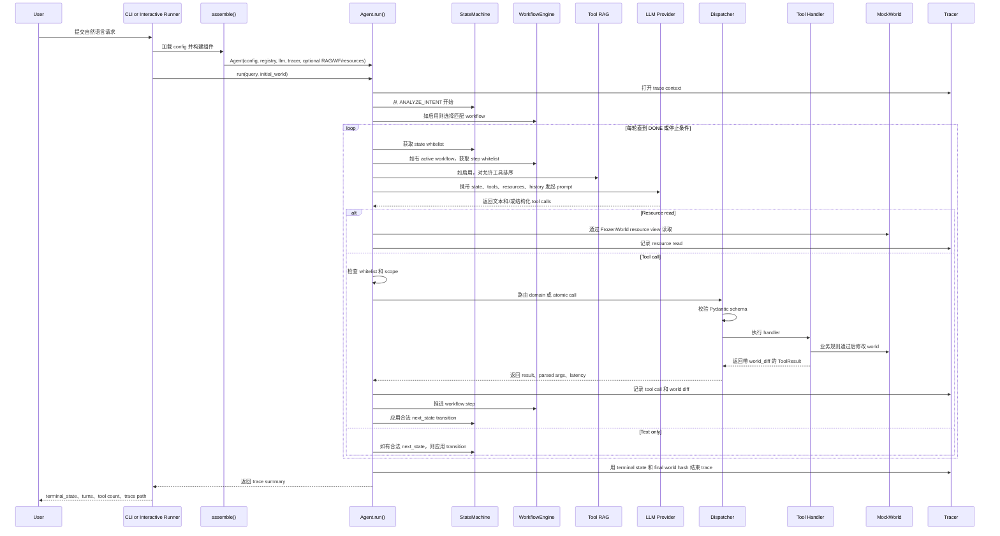
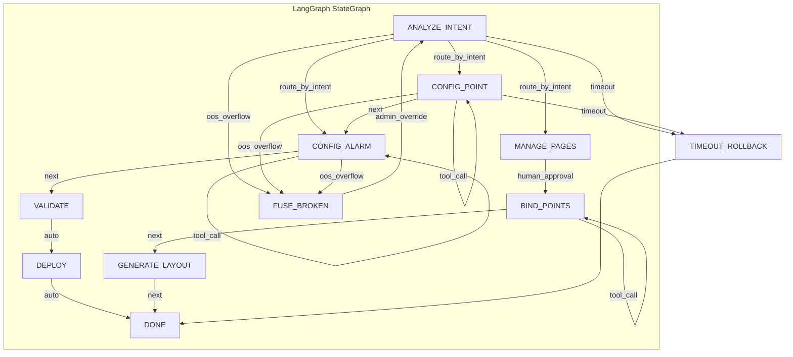

# SCADA Agent 结构报告

本文说明本项目中的 agent 是如何组织的，以及一条自然语言用户请求如何变成 demo SCADA 世界中的具体编辑结果。
## 1. 执行摘要

这个项目是一个纯 Python 的 SCADA 配置 agent。最重要的设计思想是：

> LLM 不直接编辑系统。LLM 只提出文本、工具调用和状态切换建议。Python 运行时负责决定 LLM 能看到哪些工具，校验每一次调用，执行被批准的工具处理器，修改内存中的 world，并记录 trace。

因此，这个系统更像是一个带 LLM 规划器的受约束 workflow engine，而不是一个不受约束的聊天机器人。

功能全部打开的配置是 `configs/F_full_four_in_one.yaml`。它组合了：

1. 分层工具：向模型暴露 `manage_alarms` 这样的 domain tool，再用 `action` 字段选择具体 atomic operation。
2. Tool RAG：根据用户请求对当前允许的工具进行相关性排序，让模型看到更小的工具集合。
3. Workflow engine：把已知任务类型路由到 YAML 定义的步骤序列中。
4. State machine：强制执行每个状态下的工具白名单。
5. Resource separation：让模型通过 `read_resource` 读取数据，但写操作仍然必须走经过校验的工具。

这个 demo 编辑的是内存中的 `MockWorld`，不是实际 SCADA 部署。这个 world 包含 pages、widgets、points、alarms、devices、histories、scripts、deployments 和 project metadata。

## 2. 简短术语表

| 术语 | 在本项目中的含义 |
| --- | --- |
| LLM | 大型语言模型。它读取 prompt，并提出文本回复或结构化工具调用。 |
| Agent | 围绕 LLM 的完整运行时：state machine、workflow、tool registry、dispatcher、world 和 tracer。 |
| Tool call | LLM 发出的结构化请求，例如 `manage_points(action="create_point", ...)`。 |
| RAG | Retrieval-augmented generation。这里指在调用 LLM 前，先选出最相关的、且当前允许的工具。 |
| Workflow | 针对已知任务类型的 YAML 配方，例如报警配置流程。 |
| State machine | 硬性运行时控制器，用来限制每个阶段合法的操作。 |
| MockWorld |  SCADA 项目状态，工具会读取和编辑它。 |
| Trace | 一次运行的 JSONL 审计记录。 |

## 3. 源码地图

主要实现文件如下：

| 区域 | 文件 | 作用 |
| --- | --- | --- |
| CLI 和运行时循环 | `agent/orchestrator.py` | 组装 agent，并运行逐轮执行循环。 |
| 配置模型 | `agent/config.py`, `configs/*.yaml` | 打开或关闭不同架构特性。 |
| LLM 适配器 | `agent/llm.py` | 定义 provider 接口、mock LLM 和 OpenAI-compatible providers。 |
| 工具注册表 | `agent/tool_registry.py` | 注册所有 atomic tools 和 domain tools。 |
| 工具执行 | `agent/dispatcher.py`, `tools/*.py` | 校验参数，把 domain call 路由到 atomic handler，并修改 world。 |
| 运行时防线 | `agent/state_machine.py` | 定义状态、允许的转移，以及每个状态的工具白名单。 |
| 工具检索 | `agent/tool_rag.py` | 用 BM25 和确定性的 dense encoder 对允许工具排序。 |
| 工作流 | `agent/workflow.py`, `workflows/*.yaml`, `workflows/handlers.py` | 定义任务配方和 deterministic validation steps。 |
| 只读资源 | `resources/*.py` | 提供基于 URI 的只读 world 视图。 |
| World 模型 | `world/*.py` | Pydantic 数据模型和内存 world store。 |
| Trace 输出 | `agent/tracer.py` | 把运行记录写入 `results/<run_id>/traces.jsonl`。 |
| 手动 runner | `eval/interactive_runner.py` | 交互式 shell，用于加载 world、config、golden case 和 query。 |
| 评估 | `eval/*.py`, `scripts/*.py`, `tests/*.py` | Golden dataset、metrics、judges、experiment runners 和 tests。 |

## 4. 心智模型

传统后端请求处理器通常会解析 HTTP 请求、调用业务逻辑、写数据库并返回响应。

这个 agent 的骨架类似，只是多了一个规划组件：

1. 用户提交自然语言请求。
2. 运行时计算当前允许的操作上下文。
3. LLM 提议下一步动作。
4. 运行时校验该提议。
5. 被批准的工具代码编辑 world。
6. Trace 记录发生了什么。

LLM 的价值在于把模糊语言映射到结构化操作。系统的其他部分则负责让这种映射受约束、可审计、可测试。

## 5. 核心组件

### 5.1 Agent 组装

`agent/orchestrator.py` 中的 `assemble()` 函数会从 YAML 配置构建运行时：

1. 加载 `ExperimentConfig`。
2. 构建 `ToolRegistry`。
3. 构建 LLM provider。
4. 创建 `Tracer`。
5. 如果配置打开 Tool RAG，则构建 tool index。
6. 如果配置打开 workflow，则加载 workflow YAML。
7. 如果配置打开 resource separation，则创建 resource registry。
8. 返回一个 `Agent`。


### 5.2 Agent 运行时循环

`Agent.run()` 是系统中心。每次运行会收到：

- 用户 query；
- 初始 `MockWorld`；
- 用于 trace 和 evaluation 的 metadata；
- 可选 event sink，用于实时显示。

循环最多运行 `max_turns` 轮，默认是 12。每一轮会：

1. 计算当前 state 和 workflow step 下允许的工具。
2. 如果启用了 Tool RAG，则对这些工具排序。
3. 渲染 system prompt，其中包含当前 state、允许的 state transitions、可见工具、resources 和 workflow context。
4. 调用 LLM。
5. 处理纯文本回复、resource reads 或 tool calls。
6. 校验被批准的 tool calls。
7. （可选）推进 workflow 和 state。
8. 在agent输出 `DONE`、没有进一步有用动作，或 `max_turns` 耗尽时停止。


### 5.4 Tool Registry

`agent/tool_registry.py` 包含所有的工具

项目区分两类工具：

- Atomic tool：具体操作，例如 `create_point` 或 `create_analog_alarm`。
- Domain tool：一类工具的集合，例如 `manage_points` 或 `manage_alarms`，通过 `action` 字段选择 atomic operation。

在 flat mode 中，模型会直接看到大量 atomic tools。

在 hierarchical mode 中，模型看到更少的 domain tools。Dispatcher 会解包被选中的 `action`，并执行对应 atomic handler。这样可以缩小 prompt，并让运行时拥有从 domain 到具体 operation 的清晰映射。

默认 registry 构建 500 个 atomic tools。核心 SCADA domains 包含 alarms、points、pages、graphics、history、scripts 和 deployment。

### 5.5 Dispatcher 和 Tool Handlers

`agent/dispatcher.py` 负责模型提议和 world 变化之间的执行。

对于 atomic call：

1. 查找 atomic tool。
2. 如有必要，丢弃 caller-supplied `action`。
3. 用该工具的 Pydantic model 校验参数。
4. 在 `MockWorld` 上运行 handler。

对于 domain call：

1. 查找 domain tool。
2. 要求有一个 `action` 字符串。
3. 确认该 action 存在于 domain 中。
4. 用以 `action` 为 discriminator 的 union 校验参数。
5. 运行匹配的 atomic handler。

每个工具都返回 `ToolResult`：

```python
ToolResult(
    ok: bool,
    error_code: str,
    error_msg: str | None,
    data: dict,
    world_diff: dict | None,
)
```

`tools/*.py` 中的 handler code 实现业务规则。例如：

- `tools/manage_points.py` 创建、更新、删除或列出 SCADA points。
- `tools/manage_alarms.py` 创建或修改 alarms，并检查被引用的 points 是否存在。
- `tools/deployment.py` 在 deployment 前做一致性校验。

### 5.6 State Machine

`agent/state_machine.py` 定义了功能阶段，例如：

- `ANALYZE_INTENT`
- `CONFIG_POINT`
- `CONFIG_ALARM`
- `MANAGE_PAGES`
- `GENERATE_LAYOUT`
- `BIND_POINTS`
- `CONFIG_HISTORY`
- `CONFIG_SCRIPT`
- `VALIDATE`
- `DEPLOY`
- `ASK_USER`
- `DONE`

每个 state 有：

- description；
- allowed atomic tools；
- legal next states；
- terminal flag。

这可以看做是硬性防线。如果模型提出的工具不在当前 state 的白名单中，orchestrator 会记录 `OUT_OF_SCOPE`，并且不会调用 tool handler。

### 5.7 Tool RAG

State machine 和 workflow 会先决定哪些工具被允许。Tool RAG 只是在这个允许集合内根据 query 相关性排序，并截断到 `top_k`。

排序组合了：

- BM25 sparse lexical scoring；
- 确定性的 hashing TF-IDF dense vectors；
- 基于 name 和 token overlap 的 simple reranker。

这可以缩小 LLM prompt，同时不放松 safety constraints。

### 5.8 Workflow Engine

`agent/workflow.py` 从 `workflows/*.yaml` 加载 YAML workflows。

Workflow 是一个有名称的 recipe，由多个 step 组成。Step 可以是：

- `llm_step`：让 LLM 行动，但只暴露该 step 允许的工具白名单。
- `deterministic_step`：不问 LLM，直接运行 Python 代码。

例子：`workflows/alarm_config.yaml` 包含：

1. `discover_points`：处于 `ANALYZE_INTENT`，可选地 list points 或 pages。
2. `create_or_update_alarm`：处于 `CONFIG_ALARM`，允许 alarm-related tools。
3. `validate`：处于 `VALIDATE`，运行 deterministic project validation handler。

Workflow whitelist 会和 state-machine whitelist 取交集。模型只能看到交集。

### 5.9 Resource Layer

`resources/*.py` 中的 resources 是只读的。

合成工具名是：

```text
read_resource(uri)
```

示例 URI：

- `scada://points`
- `scada://points/{tag}`
- `scada://pages`
- `scada://alarms`
- `scada://deployments/{deployment_id}`

Handlers 收到的是 `FrozenWorld`，它暴露 world 数据的副本。这意味着 resource reads 绝对不会意外修改world状态。写操作仍然必须通过真正的 tools。

### 5.10 Mock World

`world/models.py` 定义了实体：

- `Point`
- `Widget`
- `Page`
- `Alarm`
- `Device`
- `HistoryConfig`
- `Script`
- `Deployment`

`world/memory_backend.py` 实现了 `MockWorld`，用 dictionaries 存这些实体。

重要方法：

- `snapshot()`：返回可序列化的深拷贝 world state。
- `restore()`：用 snapshot 替换当前 state。
- `diff()`：计算新增、修改和删除的 entity paths。
- `hash()`：计算 canonical world state 的 SHA-256 hash。
- `match_against_expected()`：和 golden expected diffs 对比。

在这个 demo 中，“编辑”就是修改这个内存中的 world。

### 5.11 Tracing

`agent/tracer.py` 会为每次运行记录结构化 trace。

每条 trace 包含：

- query metadata；
- 进入和退出过的 states；
- LLM calls；
- tool calls；
- resource reads；
- initial 和 final world hashes；
- tool result data 和 world diffs；
- RAG 和 workflow metadata；
- latency 和 token totals。

CLI 把 traces 写到：

```text
results/<run_id>/traces.jsonl
```

这使得 agent 可以被调试和评估。

## 6. 完整流程：从用户输入到编辑完成

下面的 sequence 描述了一个用户请求的完整路径，例如：

```text
create analog point TEMP_201 range 0~200
```



### 逐步运行细节


1. 用户输入从两个主要入口之一进入。
   - CLI：`python -m agent.orchestrator --config ... --query ...`
   - Interactive runner（用于调试）：`python -m eval.interactive_runner`，然后输入 `query ...`

2. Runner 创建或复用 initial world。
   - CLI 默认可以调用 `build_demo_world()`，除非使用 `--no-seed-demo-world`。
   - Interactive runner 会维护 session world，并可以加载 golden cases 或 JSON world snapshots。

3. `assemble()` 加载 config 并构建 agent。
   - Registry：所有 domain 和 atomic tools。
   - LLM：mock 或 OpenAI-compatible provider。
   - Tracer：输出路径和 trace metadata。
   - 可选 Tool RAG index。
   - 可选 workflow catalogue。
   - 可选 resource registry。

4. `Agent.run()` 初始化执行。
   - 创建或接收一个 `MockWorld`。
   - 如果状态机打开，从 `ANALYZE_INTENT` 启动 `StateMachine`。
   - 如果 workflow 打开且 trigger 匹配，则选择 workflow。
   - 打开 trace context，并记录 initial world hash。

5. Agent 计算当前 turn 的 visible tools。
   - 从所有 atomic tools 开始。
   - 如果 state machine 打开，只保留当前 state 允许的 tools。
   - 如果 workflow active，则和当前 workflow step 的 `allowed_tools` 取交集。
   - 如果 Tool RAG 打开，则对剩余 tools 排序并截断。
   - 如果 hierarchical tools 打开，则把 allowed atomic tools 投影到 domain tools，并携带 filtered `allowed_actions`。

6. Agent 构建 system prompt。
   - 当前 state。
   - 合法 next states。
   - 可见的tools。
   - 如果启用 resources，则加入 resource URI catalogue。
   - 如果有 active workflow，则加入 workflow context。
   - Safety 和 behavior rules。

7. LLM 响应。
   - 可能只返回文本。
   - 可能提出 `next_state`。
   - 可能返回一个或多个 tool calls。
   - 可能调用 `read_resource` tool。

8. （可选）Resource reads
   - Resource registry 解析 URI。
   - Handler 从 `FrozenWorld` 读取。
   - Agent 记录 resource read。
   - 结果进入 history，供下一轮 LLM 使用。

9. Tool calls 会经过硬性校验。
   - Orchestrator 检查被选 atomic operation 是否在当前 allowed pool 中。
   - 如果不在，则记录 `OUT_OF_SCOPE`，并且不调用 handler。
   - 如果在，则 dispatch 该 call。

10. Dispatcher 校验 schema。
    - Flat mode 按 atomic tool 的 args model 校验。
    - Hierarchical mode 按以 `action` 为 key 的 discriminated union 校验 domain call。
    - Pydantic failure 会变成 `SCHEMA_ERROR`，不会变成未捕获异常。

11. Tool handler 应用业务规则并编辑 world。
    - 例子：`CreatePoint.run()` 检查 duplicate tag，创建 `Point`，插入 `world.points`，并返回 diff。
    - 例子：`CreateAnalogAlarm.run()` 在创建 `Alarm` 前，会检查 point 是否存在且是否为 analog。

12. Orchestrator 记录结果。
    - 被选工具。
    - Action。
    - Arguments。
    - Schema validity。
    - Error code。
    - Result data。
    - World diff。
    - Intended 和 referenced entities。

13. Workflow 和 state 推进。
    - 成功的 workflow step 会推进到下一 step。
    - Deterministic steps 可以运行 Python handlers，例如 project validation。
    - 合法的 LLM-proposed `next_state` 会切换 state machine。
    - 非法 transitions 会被 `can_transit()` 忽略。
    - 继续下一轮循环。

14. 循环结束。
    - 进入 terminal state `DONE`。
    - 没有 tool call 且没有有用 transition。
    - `max_turns` 耗尽。

15. Trace finalization 证明发生了什么变化。
    - 记录 final world hash。
    - Trace 作为一条 JSONL record 写入。
    - Caller 得到 summary，包括 `trace_id`、terminal state、total turns、tool calls、resource reads 和 trace path。


## 7. Safety 和可靠性边界

本项目有多层机制让模型行为保持受控：

1. Tool过滤
   - LLM 只能看到当前 visible tools。
   - 在 hierarchical mode 中，domain tools 只暴露当前允许的 actions。

2. 运行时检查
   - Orchestrator 会在 dispatch 前重新检查 proposed tool 是否被允许。
   - Forbidden call 会变成 `OUT_OF_SCOPE`。

3. Schema validation
   - 每个 tool call 都通过 Pydantic 解析。
   - 错误参数会变成 `SCHEMA_ERROR`。

4. 业务逻辑检查
   - Tool handlers 会检查 references、types、duplicate IDs 和其他 domain rules。
   - Failure 会返回结构化 error codes，例如 `POINT_NOT_FOUND`、`TYPE_MISMATCH` 或 `BUSINESS_RULE`。

5. 读写分离
   - Resources 使用 `FrozenWorld`。
   - Resource reads 无法修改 world。

6. 轮数限制
   - `max_turns` 防止无限循环。

7. 记录
   - 每个 LLM turn、tool call、resource read、state transition 和 world diff 都会被记录。


## 9. 生产部署指南：将本项目架构应用到实际 SCADA 系统

本节说明如何将本 demo 的分层架构迁移到真实 SCADA 生产环境。核心设计理念——**LLM 只提建议，运行时做决定**——在生产中不仅成立，而且更加关键。

### 9.1 World 后端：从 MockWorld 到真实 SCADA

| 组件 | Demo 实现 | 生产实现 |
| --- | --- | --- |
| 数据存储 | 内存字典 (`MockWorld`) | 关系数据库 + 时序数据库 + Redis 缓存 |
| 设备通信 | 无 | OPC-UA / Modbus / IEC 61850 / MQTT 网关 |
| 配置持久化 | 无 | 数据库事务 + 配置版本管理 + 变更审计日志 |
| 实时状态 | 无 | 通过 WebSocket/gRPC Stream 推送实时值 |
| 历史数据 | 无 | 集成 PI System / InfluxDB / TimescaleDB |

迁移要点：

- **实现 `WorldBackend` 接口**：将 `MockWorld` 的 `get_point()`, `create_alarm()` 等方法抽象为接口，分别实现 `MockWorld`（测试用）和 `ProductionWorld`（连接真实后端）。
- **事务性写入**：所有 tool handler 的写操作应包裹在数据库事务中，失败时回滚。`ToolResult.world_diff` 可作为乐观锁的版本依据。
- **连接池管理**：对 OPC-UA / Modbus 等设备连接使用连接池，避免每次 tool call 都新建连接。

### 9.2 Tool Handler 分层策略

生产环境中，Tool Handler 应分为三层：

```
LLM 提议 → Schema 校验 → 权限检查 → 业务规则 → 设备/数据库操作 → 审计日志
```

| 层级 | 职责 | 示例 |
| --- | --- | --- |
| **校验层** | Pydantic schema 校验、参数范围检查 | `range 0~200` 检查是否在设备量程内 |
| **业务规则层** | 跨实体一致性检查、依赖分析 | 删除 point 前检查是否被 alarm 引用 |
| **基础设施层** | 真实设备/数据库操作 | 通过 OPC-UA 写入 PLC 寄存器 |

**建议**：不要在一个 handler 里同时做校验和设备操作。将业务规则抽离为独立的 `Validator` 类，可在 workflow 的 deterministic step 中复用。

### 9.3 State Machine 与 Workflow 的生产级增强

#### 状态机增强

- **状态持久化**：将 state machine 的当前状态存入数据库。这样 agent 可以在崩溃后从断点恢复，也支持人工审批流程中的暂停/继续。
- **状态超时**：为每个 state 设置 `max_dwell_seconds`。超时后自动回滚到前一个安全状态或触发告警。
- **熔断状态**：添加 `FUSE_BROKEN` 状态。当连续 N 次工具调用返回 `OUT_OF_SCOPE` 或 `SCHEMA_ERROR` 时，自动进入熔断，防止 LLM 震荡消耗生产资源。

#### LangGraph 集成方案

生产环境中，不应使用 demo 中手写的 `StateMachine` 类，而应迁移到 **LangGraph** 作为状态机引擎。LangGraph 提供了原生支持循环、条件分支、并行执行和持久化的图状态机，与本项目的需求高度吻合。

##### 为什么选择 LangGraph

| 需求 | 手写 StateMachine | LangGraph |
| --- | --- | --- |
| 状态持久化与恢复 | 无 | 内置 `Checkpointer` 接口，支持内存/SQLite/PostgreSQL |
| 条件分支 | `if/else` 硬编码 | 原生 `ConditionalEdge` |
| 并行子图 | 不支持 | `Parallel` node + `Send` API |
| 人工暂停/继续 | 无 | `interrupt()` 函数，等待人工输入后恢复 |
| 循环控制 | `while` 循环 | 图结构天然支持循环，`max_turns` 通过 `recursion_limit` 控制 |
| 可观测性 | 手动 log | 集成 LangSmith 追踪，每个 node 的输入输出自动记录 |
| 图可视化 | 无 | 自动生成 Mermaid 状态图 |
| 分布式执行 | 无 | 支持远程节点执行 |

##### 迁移架构



##### LangGraph 节点定义示例

每个 State Machine state 映射为一个 LangGraph `Node`。Node 的输入是当前的 agent 状态，输出是更新后的状态 + 可选的 tool call：

```python
from langgraph.graph import StateGraph, MessagesState
from typing import Literal

# 定义 agent 状态类型
class AgentState(MessagesState):
    scada_state: str                    # 当前 SCADA state
    tool_whitelist: list[str]           # 当前允许的工具列表
    allowed_transitions: list[str]      # 合法下一状态列表
    tool_call_count: int                # 当前 state 内的工具调用计数
    oos_count: int                      # 越权调用计数（熔断用）
    world_hash: str                     # world 状态快照 hash
    trace_id: str | None                # 当前运行的 trace ID
    human_feedback: dict | None         # 人工审批反馈

# 节点：分析意图
def analyze_intent_node(state: AgentState) -> dict:
    """调用 LLM 分析用户意图，路由到对应 SCADA state"""
    llm_response = call_llm(
        system_prompt=build_system_prompt(state),
        messages=state.messages
    )
    intent = parse_intent(llm_response)
    return {
        "scada_state": intent.next_state,
        "messages": [llm_response.message],
        "tool_call_count": 0,
        "oos_count": 0,
    }

# 条件边：根据 intent 路由到不同 state
def route_by_intent(state: AgentState) -> Literal["config_point", "config_alarm", "manage_pages"]:
    intent_map = {
        "CONFIG_POINT": "config_point",
        "CONFIG_ALARM": "config_alarm",
        "MANAGE_PAGES": "manage_pages",
    }
    return intent_map.get(state.scada_state, "config_point")

# 节点：工具执行
def tool_execution_node(state: AgentState) -> dict:
    """校验并执行 LLM 提议的工具调用"""
    tool_call = state.messages[-1].tool_calls[0]

    # 白名单检查
    if tool_call.name not in state.tool_whitelist:
        return {
            "oos_count": state.oos_count + 1,
            "messages": [ToolMessage(content="OUT_OF_SCOPE", tool_call_id=tool_call.id)],
        }

    # Schema 校验 + 执行
    result = dispatcher.dispatch(tool_call)
    return {
        "tool_call_count": state.tool_call_count + 1,
        "world_hash": result.world_hash,
        "messages": [ToolMessage(content=result.json(), tool_call_id=tool_call.id)],
    }

# 条件边：熔断检测
def check_fuse(state: AgentState) -> Literal["continue", "fuse"]:
    if state.oos_count >= 3:
        return "fuse"
    return "continue"

# 组装图
builder = StateGraph(AgentState)
builder.add_node("analyze_intent", analyze_intent_node)
builder.add_node("config_point", tool_execution_node)
builder.add_node("config_alarm", tool_execution_node)
builder.add_node("fuse_broken", fuse_node)
builder.set_entry_point("analyze_intent")
builder.add_conditional_edges("analyze_intent", route_by_intent)
builder.add_conditional_edges("config_point", check_fuse, {
    "continue": "config_point",
    "fuse": "fuse_broken",
})
graph = builder.compile(checkpointer=MemorySaver())
```

##### 与现有组件的集成

```python
class LangGraphStateMachineAdapter:
    """将本项目的 StateMachine 接口适配到 LangGraph"""

    def __init__(self, config: ExperimentConfig):
        self.graph = self._build_graph(config)
        self.checkpointer = self._create_checkpointer(config)

    def _build_graph(self, config) -> CompiledStateGraph:
        builder = StateGraph(AgentState)
        for state_def in config.state_machine.states:
            builder.add_node(state_def.name, self._create_node(state_def))
        return builder.compile()

    def _create_checkpointer(self, config):
        if config.persistence.type == "postgres":
            from langgraph.checkpoint.postgres import PostgresSaver
            return PostgresSaver.from_conn_string(config.persistence.dsn)
        elif config.persistence.type == "sqlite":
            from langgraph.checkpoint.sqlite import SqliteSaver
            return SqliteSaver.from_conn_string(config.persistence.path)
        return MemorySaver()

    def transition(self, current_state: str, proposed_next: str) -> bool:
        return proposed_next in self.graph.get_node(current_state).allowed_transitions

    def get_whitelist(self, state_name: str) -> list[str]:
        return self.graph.get_node(state_name).tool_whitelist
```

##### 关键生产特性

1. **Checkpointer 持久化**：LangGraph 的 `Checkpointer` 自动保存每次 `interrupt` 和 `node` 完成后的状态快照。PostgreSQL 版本的 Checkpointer 支持事务性写入，保证 agent 崩溃后可以从最近一个 checkpoint 恢复。

2. **Human-in-the-loop**：在需要人工审批的节点（如 `DEPLOY`）前插入 `interrupt()`：

   ```python
   def deploy_node(state: AgentState) -> dict:
       preview = build_deployment_preview(state.world_hash)
       result = interrupt({
           "question": "确认部署以下变更？",
           "preview": preview.model_dump(),
       })
       if result.get("approved"):
           return execute_deployment(state)
       return {"scada_state": "ROLLBACK"}
   ```

3. **LangSmith 追踪**：配置 LangSmith 后，每次 agent 运行的完整调用链（LLM 调用、工具执行、状态转换）自动上传，可在 LangSmith UI 中查看延迟分布、Token 消耗和失败模式。

4. **动态图构建**：通过配置驱动的方式动态构建 StateGraph，避免硬编码不同站点的状态集合差异：

   ```python
   def build_graph_from_config(config: dict) -> CompiledStateGraph:
       builder = StateGraph(AgentState)
       for node_def in config["nodes"]:
           handler = NODE_REGISTRY[node_def["handler"]]
           builder.add_node(node_def["name"], handler)
       for edge_def in config["edges"]:
           if "condition" in edge_def:
               builder.add_conditional_edges(edge_def["from"],
                   CONDITION_REGISTRY[edge_def["condition"]],
                   edge_def["mapping"])
           else:
               builder.add_edge(edge_def["from"], edge_def["to"])
       return builder.compile()
   ```

#### Workflow 增强

- **人工审批步骤**：在 workflow 中插入 `human_approval_step`。例如在 deploy 前，暂停并等待运维人员确认变更内容。Workflow engine 应支持 webhook 或消息队列来接收审批结果。
- **版本化 Workflow**：Workflow YAML 应有版本号。生产环境中，不同站点的 SCADA 系统可能运行不同版本的 workflow。Agent 应根据目标站点的兼容版本选择 workflow。
- **条件分支**：扩展 workflow schema，支持 `if/else` 条件分支，例如：
  ```yaml
  steps:
    - name: check_point_type
      type: deterministic_step
      handler: check_point_type
    - name: create_alarm
      type: llm_step
      allowed_tools: ["manage_alarms"]
      condition: "{{ steps.check_point_type.output == 'analog' }}"
  ```

### 9.4 Tool RAG 的生产化

Demo 中使用 BM25 + 确定性 dense encoder。生产环境可考虑：

- **增量索引**：当新增或修改 tool 时，只更新变更部分的 embedding，不重建全量索引。可以使用 FAISS 或 LanceDB 管理向量索引。
- **多模态检索**：除了工具名称和描述，还可以索引工具的过往使用统计、常见错误模式、以及该工具在类似 query 下的成功率，作为排序的辅助信号。
- **RAG Fallback**：当 RAG 召回的工具数量低于 `min_tools` 阈值时，回退到 state machine 白名单全量，避免因检索失败导致模型无工具可用。

### 9.5 安全防线

#### 身份与权限

| 防线 | 实现方式 |
| --- | --- |
| 用户认证 | 集成 OAuth 2.0 / LDAP / 工牌系统 |
| 操作授权 | 每个 tool call 检查 `user.role` 是否允许该操作 |
| 作用域隔离 | 运维人员只能操作 assigned 站点，不能跨站操作 |
| 操作二次确认 | 高风险操作（删除、批量修改）需要二次确认 token |

#### 审计与不可否认性

每条 trace 应包含：

- 操作人身份（user_id、role）
- 操作时间（NTP 同步的时间戳）
- 操作前后的 world state hash（用于事后验证完整性）
- 审批记录（如有人工审批，记录审批人、审批时间、审批结果）

Trace 应写入**不可篡改的审计存储**（如 AWS CloudTrail、Elasticsearch 或专门的审计数据库），保留期限符合合规要求（通常 1-7 年）。

### 9.6 监控与可观测性

| 指标 | 用途 | 告警阈值示例 |
| --- | --- | --- |
| `agent.loop_stuck` | 检测死循环 | > 3 次连续相同 tool call |
| `agent.oos_rate` | 越权调用率 | > 10% 触发告警 |
| `agent.schema_error_rate` | Schema 校验失败率 | > 15% 触发告警 |
| `agent.latency_p99` | LLM 调用延迟 | > 30s 触发告警 |
| `agent.tool_execution_time` | 工具执行耗时 | > 5s 触发告警 |
| `agent.human_approval_timeout` | 人工审批超时 | > 30min 触发升级 |

建议集成 OpenTelemetry 进行分布式追踪，将 agent 的每次运行作为一个 trace span，tool call 和 LLM call 作为子 span。

### 9.7 高可用与容错

```
用户请求 → 负载均衡 → Agent 实例 1
                          Agent 实例 2  (active-active)
                          Agent 实例 3
                    ↓
              共享状态存储 (Redis/PostgreSQL)
                    ↓
              SCADA 设备网关 (OPC-UA cluster)
```

- **Agent 无状态化**：将 state machine 状态、world 连接信息、trace buffer 存储在外部存储中。Agent 实例可以水平扩展。
- **优雅降级**：当 LLM provider 不可用时，回退到基于规则的 deterministic handler（只处理预定义的标准操作）。当数据库不可用时，使用本地缓存继续处理只读查询。
- **断路器模式**：对 LLM provider、数据库、设备网关分别实现断路器。连续失败超过阈值后快速失败，避免雪崩。

### 9.8 测试与发布策略

| 阶段 | 测试内容 | 环境 |
| --- | --- | --- |
| 单元测试 | Tool handler、state machine、workflow 逻辑 | CI |
| 集成测试 | Agent 完整流程 + MockWorld | CI |
| 回归测试 | Golden dataset 全部 100 个 case | CI ( nightly ) |
| 预发布 | 在 staging SCADA 上运行 golden cases | Staging |
| 金丝雀发布 | 1% 生产流量导向新版本 | Production |
| 全量发布 | 100% 流量 | Production |

**关键实践**：每次修改 tool handler、workflow 或 state machine 后，必须通过 golden dataset 回归测试。Golden dataset 中的每个 case 都对应一个具体的 SCADA 操作场景——通过率低于 95% 不应发布。

### 9.9 部署 Checklist

```markdown
- [ ] World 后端：确认 OPC-UA / Modbus 网关连接正常
- [ ] 数据库：确认事务性写入和审计日志表已创建
- [ ] 状态机：确认熔断和超时配置已设置
- [ ] Workflow：确认人工审批 webhook 端点可用
- [ ] Tool RAG：确认向量索引已构建并可增量更新
- [ ] 安全：确认 OAuth 2.0 / LDAP 集成完成
- [ ] 监控：确认 OpenTelemetry exporter 和告警规则已配置
- [ ] 高可用：确认负载均衡、断路器、优雅降级已实现
- [ ] 回归测试：确认 golden dataset 通过率 >= 95%
- [ ] 回滚方案：确认上一版本的 agent 和 workflow 可快速切换
```

---

## 10. 总结

本项目通过分层 Tool 架构、Tool RAG、Workflow 引擎、状态机白名单和 Resources 读写分离五大策略的组合，展示了一个**受约束的、可审计的、可测试的** LLM Agent 架构。从 demo 到生产，核心不变的是：LLM 只提建议，运行时做决定。生产部署在此基础上增加了持久化、高可用、安全合规和可观测性等工程能力，使这套架构能够在真实的工业 SCADA 场景中安全、可靠地运行。


