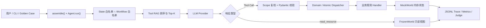

# SCADA Agent 项目分析

## 1. 总体结论

当前项目已经完成一个较完整的“受约束 SCADA Agent 研究原型”：核心运行时、真实模型接入、评测体系、消融实验和报告链路均已实现。

项目的核心价值不是直接控制真实 SCADA，而是验证以下运行时边界：

> LLM 负责提出操作建议，Python 运行时负责工具筛选、权限复检、参数校验、业务执行和审计记录。

因此，本项目更接近“带 LLM 规划器的受约束工作流引擎”，而不是一个直接执行任意命令的聊天机器人。

实验结果最明确支持 Tool RAG 的降本增效，以及 Workflow 对执行路径稳定性的改善。当前数据并不支持“约束层越多，任务成功率就越高”：完整配置 F 的任务成功率反而低于若干较简单的配置。

## 2. 软件架构



### 2.1 入口与运行时编排

核心入口是 [`agent/orchestrator.py`](agent/orchestrator.py)。`assemble()` 根据 YAML 配置构建：

1. `ExperimentConfig`
2. `ToolRegistry`
3. LLM provider
4. `Tracer`
5. 可选 Tool RAG 索引
6. 可选 Workflow catalogue
7. 可选 Resource registry

`Agent.run()` 是执行中心，每轮执行以下步骤：

1. 根据当前 state 和 workflow step 计算允许的 atomic tools；
2. 如果启用 RAG，在允许集合内排序并截断；
3. 在分层模式下把 atomic tools 投影为 domain/action 工具；
4. 渲染带有当前状态、可用工具、资源和工作流上下文的 system prompt；
5. 调用 LLM；
6. 处理文本回复、状态切换、资源读取和工具调用；
7. 重新做越权检查、参数校验和业务规则校验；
8. 更新 World、Workflow、StateMachine 和 Trace；
9. 在 `DONE`、无进一步有效动作或达到最大轮数时结束。

### 2.2 工具层

项目区分两类工具：

- **Atomic Tool**：单个具体操作，如 `create_point`、`create_analog_alarm`、`bind_point`。
- **Domain Tool**：领域级入口，如 `manage_points`、`manage_alarms`，通过 `action` 字段选择具体 atomic operation。

工具调用由 [`agent/dispatcher.py`](agent/dispatcher.py) 分发：

- 扁平模式按 atomic tool 的 Pydantic 参数模型校验；
- 分层模式按 `action` discriminator 对 union schema 校验；
- 参数错误统一转换为 `SCHEMA_ERROR`；
- 合法调用才进入具体 handler。

每个工具返回统一的 `ToolResult`：

```python
ToolResult(
    ok: bool,
    error_code: str,
    error_msg: str | None,
    data: dict,
    world_diff: dict | None,
)
```

### 2.3 状态机

[`agent/state_machine.py`](agent/state_machine.py) 当前定义 12 个状态：

- `ANALYZE_INTENT`
- `CONFIG_POINT`
- `CONFIG_ALARM`
- `MANAGE_PAGES`
- `GENERATE_LAYOUT`
- `BIND_POINTS`
- `CONFIG_HISTORY`
- `CONFIG_SCRIPT`
- `VALIDATE`
- `DEPLOY`
- `ASK_USER`
- `DONE`

每个状态包含：

- 状态描述；
- 允许的 atomic tools；
- 合法的下一状态；
- 是否为终态。

当模型提出当前状态不允许的工具时，运行时记录 `OUT_OF_SCOPE`，不会调用 handler。

需要注意：配置中的 `state_machine.enabled` 主要控制工具白名单和越权复检；`StateMachine` 对象本身以及状态迁移合法性检查在运行时仍然存在。因此 D 与 E 的实验更准确地说是在比较“是否启用硬工具白名单”，而不是完全有无状态机。

### 2.4 Tool RAG

[`agent/tool_rag.py`](agent/tool_rag.py) 使用确定性的混合检索：

- BM25 稀疏检索；
- numpy hashing TF-IDF dense encoder；
- 工具名和 token overlap 的简单 reranker；
- 状态机/Workflow 先做硬过滤，RAG 只做软排序。

默认流程是：

```text
允许工具集合 → BM25 + Dense 混合排序 → Rerank → Top-K
```

默认 dense encoder 不需要下载大模型，便于离线和可重复实验；生产环境可替换为 sentence-transformers、FAISS 或其他向量索引。

### 2.5 Workflow Engine

[`agent/workflow.py`](agent/workflow.py) 从 `workflows/*.yaml` 加载工作流。工作流步骤有两类：

- `llm_step`：让模型行动，但限制该步骤可见的 tools；
- `deterministic_step`：直接执行 Python handler，例如项目一致性校验。

当前仓库有 9 个 YAML workflow，覆盖：报警、点位、历史、图形、泵站画面、化工画面、点位绑定、脚本和部署检查。

Workflow whitelist 与 StateMachine whitelist 取交集，形成最终可调用集合。部分可选步骤支持 `fast_forward_for_atomic()`，避免模型跨过可选步骤时被错误判为越权。

### 2.6 Resource 层

Resources 通过 `read_resource(uri)` 暴露只读视图。底层使用 `FrozenWorld` 深拷贝，handler 修改读取结果不会穿透到底层 World。

当前提供 11 类 URI 视图，覆盖：

- pages / widgets
- points
- devices
- alarms
- history configuration
- scripts
- deployments

写操作仍需经过正式 Tool handler。

### 2.7 World 数据层

[`world/models.py`](world/models.py) 和 [`world/memory_backend.py`](world/memory_backend.py) 定义了：

- `Point`
- `Widget`
- `Page`
- `Alarm`
- `Device`
- `HistoryConfig`
- `Script`
- `Deployment`

`MockWorld` 提供：

- `snapshot()`
- `restore()`
- `diff()`
- `hash()`
- `reset()`
- Golden final-state matching

当前“编辑 SCADA”本质上是修改内存中的 Pydantic 对象，而不是修改真实设备、数据库或 PLC。

### 2.8 Trace 与评测层

[`agent/tracer.py`](agent/tracer.py) 把每条运行写成 JSONL trace，内容包括：

- query 和 Golden metadata；
- state 进入/退出记录；
- LLM 调用、token、延迟；
- tool calls、参数、错误码、结果数据；
- `world_diff`；
- resource reads；
- RAG 和 Workflow metadata；
- initial/final world hash。

评测目录提供：

- Golden Dataset schema；
- 批量 runner、并发、限流、断点续跑；
- deterministic metrics；
- LLM-as-Judge 和 rubric；
- Interactive Runner。

## 3. 已完成的工作

### 3.1 Phase 0/1：核心骨架

- 建立 Python 项目结构和依赖配置；
- 建立 MockWorld 与 Pydantic entity model；
- 实现 MockTool 基类和错误码体系；
- 实现 Tool Registry、Domain/Atomic Dispatcher；
- 实现状态机、合法状态转移和工具白名单；
- 实现 MockLLM 和 JSONL tracer；
- 完成报警创建等端到端路径。

### 3.2 Phase 2：四层约束架构

- 核心业务工具从早期 16 个扩展到 39 个；
- 增加 graphics、history、scripts、deployment 领域；
- 实现 Tool RAG；
- 实现 YAML Workflow 和 deterministic validation handler；
- 实现 FrozenWorld Resources；
- 完成 A–F 架构消融配置；
- 接入小米 Mimo 的 OpenAI-compatible API；
- 修复真实模型暴露的跨 query 状态泄漏、分层 schema 不完整、嵌套 JSON 字符串、tool result 信息丢失和 workflow 重试问题。

### 3.3 Phase 3：评测体系

- 从种子样例扩展到 100 条 Golden Cases；
- 每条记录包含初始 World、预期行为、终态 diff、轨迹、错误码和 workflow 标注；
- 实现批量 runner、重复运行、失败重试、resume 和 metadata；
- 实现工具选择、终态、参数、轨迹、越权、级联失败、资源先读后写和成本延迟指标；
- 实现 LLM-as-Judge 和交互式调试器。

当前 Golden Dataset 分布为：

| 维度                | 分布                                                                                        |
| ----------------- | ----------------------------------------------------------------------------------------- |
| domain            | page 10 / point 13 / alarm 13 / graphics 20 / history 10 / script 10 / multi 23 / other 1 |
| complexity        | simple 27 / medium 46 / complex 27                                                        |
| expected_behavior | success 67 / reject 15 / ask_for_clarification 10 / fail_or_clarify 8                     |
| workflow 标注       | 70 条；30 条自由编排                                                                             |

### 3.4 Phase 4/5：实验与分析

- 接入 DeepSeek 和 GLM 配置；
- 增加动态 `tool_count`，用于模拟 30/100/300/500 工具规模；
- 增加并发 runner、RPM 限流和 trace 写锁；
- 执行主 A–F 消融、Tool-count sweep 和 RAG Top-K sweep；
- 增加 trace 清洗、聚合、统计分析、图表、Notebook 和自动报告脚本；
- 形成双模型对比实验报告。

## 4. 实验规模与结果

归档数据包含 10,202 条原始 trace；按 `(golden_id, rep_index)` 去重后是报告使用的 9,900 条：

- 主 A–F 双模型实验：6,000 条；
- Tool-count 扫描：2,400 条；
- RAG Top-K 扫描：1,500 条。

### 4.1 主配置结果

报告中的主要指标如下：

| 模型       | 配置               | 功能成功率 | 严格轨迹成功率 | Tool F1 | 平均延迟   | 估算成本      |
| -------- | ---------------- | -----:| -------:| -------:| ------:| ---------:|
| Mimo     | A flat           | 60.2% | 56.8%   | 0.1710  | 37.20s | $0.068790 |
| Mimo     | B hierarchical   | 59.6% | 56.8%   | 0.1884  | 35.85s | $0.100475 |
| Mimo     | C + RAG          | 60.0% | 56.4%   | 0.3050  | 31.53s | $0.021682 |
| Mimo     | D + Workflow     | 52.8% | 50.6%   | 0.1393  | 39.52s | $0.026214 |
| Mimo     | E + StateMachine | 45.6% | 43.6%   | 0.2860  | 29.23s | $0.012934 |
| Mimo     | F full           | 45.4% | 44.0%   | 0.2181  | 28.20s | $0.016212 |
| DeepSeek | A flat           | 58.8% | 55.4%   | 0.1665  | 13.53s | $0.147833 |
| DeepSeek | B hierarchical   | 59.8% | 57.0%   | 0.1906  | 13.66s | $0.150209 |
| DeepSeek | C + RAG          | 58.0% | 56.8%   | 0.4518  | 10.36s | $0.024088 |
| DeepSeek | D + Workflow     | 55.4% | 54.0%   | 0.1942  | 12.13s | $0.022486 |
| DeepSeek | E + StateMachine | 51.6% | 50.0%   | 0.1108  | 13.82s | $0.020002 |
| DeepSeek | F full           | 50.0% | 48.4%   | 0.1055  | 17.25s | $0.029571 |

### 4.2 Tool RAG

从 B 到 C：

- DeepSeek 严格成功率：57.0% → 56.8%；
- DeepSeek 延迟：13.66s → 10.36s，下降 24.13%；
- DeepSeek 估算成本：下降 84.0%；
- Mimo 严格成功率：56.8% → 56.4%；
- Mimo 延迟：35.85s → 31.53s，下降 12.05%；
- Mimo 估算成本：下降 78.4%。

结论：RAG 在几乎不损害成功率的情况下显著减少了工具上下文、延迟和 Token 消耗，是当前最清晰的正向结果。

### 4.3 Workflow

无 Workflow 的 C 与有 Workflow 的 D 对比：

- DeepSeek 步骤数标准差：3.28 → 2.77，Bartlett 检验 `p=0.0002`；
- Mimo 步骤数标准差：4.00 → 3.87，Bartlett 检验 `p=0.4682`。

Workflow 对 DeepSeek 的路径收敛更明显，对 Mimo 的改善较弱。

### 4.4 StateMachine

报告显示，D → E 后 OOS 发生率并未下降：

- DeepSeek：1.20% → 13.60%；
- Mimo：9.00% → 9.60%。

原因主要是模型收到越权错误后继续重复尝试，形成重试震荡。因此，状态机本身提供了硬拦截，但还需要退避、熔断或人工确认机制。

### 4.5 Resources

报告声称 Resources 可以减少可见工具数量，但该结论需要谨慎解释：

- 配置说明要求比较 E 与 F；
- 当前分析脚本实际比较 D 与 F；
- Resources 开启后并没有从 registry 中移除原有的 list/read tools。

因此，D→F 的差异混合了 Workflow、StateMachine 和 Resources 三种因素，不能单独归因于读写分离。正确的 E→F 对比应重新计算。

## 5. 当前问题与结果边界

### 5.1 生产化边界

- `MockWorld` 是内存后端，SQLite/Redis 只是接口占位；
- 没有真实 OPC-UA、Modbus、IEC 61850 或 MQTT 设备通信；
- 没有数据库事务、配置版本、权限系统或完整审计服务；
- deployment 只是修改模拟状态，不会实际下装；
- 生产级 Human-in-the-loop 只存在于 LangGraph 迁移文档骨架中。

### 5.2 安全边界

高危操作目前主要依靠 system prompt 约束。`deploy_project(force=True)` 的 handler 仍允许绕过校验，因此尚不能称为完全的运行时安全边界。

此外，`read_resource` 主要通过 prompt 描述，未作为标准 function schema 正式加入所有 provider 的工具列表，跨模型兼容性存在风险。

### 5.3 评测口径问题

1. 三条 Golden Case 使用 `history_configs.*` 路径，而当前 World/handler 使用 `histories.*`，可能造成确定性假阴性。
2. `tool_count=30` 实际仍注册 39 个核心工具，Tool-count sweep 的 30 工具单元不完全准确。
3. `scripts/aggregate.py` 对重复 trace 保留最后一条，而 `scripts/filter_traces.py` 采用“完成度优先”的最佳 trace，二者策略不一致。
4. 归档数据中有 302 条重复/重试记录；LLM Judge 只覆盖 2,162 条 trace，整体结果主要依赖 deterministic metrics。
5. H6 缺少“扁平架构 + Workflow”单元，双因素交互效应并未被完整识别。
6. [`scripts/aggregate.py`](scripts/aggregate.py) 未识别 `deepseek-v4-flash` 的专用价格，报告中的 DeepSeek 绝对美元成本应视为估算值。

### 5.4 工作流匹配问题

`point_creation.yaml` 中部分中文关键词写成了带 `.*` 的字符串，但 `WorkflowEngine.matches()` 对 `keywords` 使用的是字面包含判断，不是正则判断。因此“新建一个模拟点位”等中文请求可能无法命中 PointCreation workflow；英文 `create point` 可以命中。

### 5.5 打包与文档问题

- `pyproject.toml` 的 wheel 配置只包含 `agent`、`tools`、`world`、`resources`，未包含 `eval`、`workflows` 和配置文件；直接构建 wheel 可能缺少评测运行所需文件。
- `README.md` 仍将 Phase 2–5 标为 pending，与当前代码和报告状态不一致。
- 报告引用 `results/aggregated.parquet`，但当前工作区和归档压缩包中都未发现该中间产物，完整复现实验需要重新聚合。

## 6. 当前验证状态

本次分析未修改项目代码，工作树保持 clean。

使用当前虚拟环境执行全量测试，结果为：

```text
215 passed, 1 failed
```

唯一失败发生在交互式 runner 的 Windows 路径处理：[`eval/interactive_runner.py`](eval/interactive_runner.py) 使用 `shlex.split(posix=False)` 解析命令，无法正确处理含空格的临时路径，导致类似以下命令被截断：

```text
world save-json C:\Users\Cui Liuyang\...\world.json
```

该问题不影响核心 Agent、工具分发和 World 编辑链路，但属于明确的 CLI 跨平台缺陷。

## 7. 最终判断

项目已经达到“可运行、可约束、可观测、可批量评测”的研究 demo 水平，最具成果的部分是：

1. 把 LLM 与实际写操作隔离；
2. 建立 state/workflow/RAG 多层工具约束；
3. 建立可重复的 Golden Dataset 和 trace 评测链路；
4. 用双模型消融实验验证 RAG 的成本收益和 Workflow 的路径稳定性。

但它还不是可以直接接入生产 SCADA 的安全系统。下一步最重要的工作应是：

- 将高危操作安全规则从 prompt 下沉到运行时策略和人工审批；
- 修正 Resources、Workflow trigger、Golden path 和 H5/H6 实验口径；
- 实现真实持久化、权限、事务、审计和设备适配层；
- 修复 Windows CLI 路径解析和打包缺失问题；
- 重新生成可信的聚合中间产物与最终报告。


