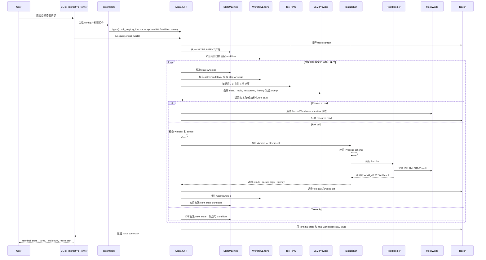
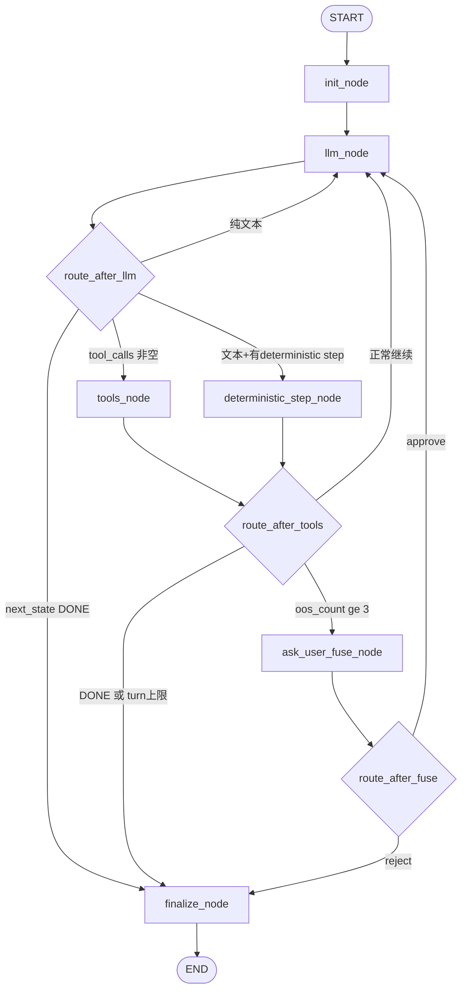

# SCADA Agent 结构报告

本文说明本项目中的 agent 是如何组织的，以及一条自然语言用户请求如何变成 demo SCADA 世界中的具体编辑结果。
## 1. 执行摘要

这个项目是一个纯 Python 的 SCADA 配置 agent。最重要的设计思想是：

> LLM 不直接编辑系统。LLM 只提出文本、工具调用和状态切换建议。Python 运行时负责决定 LLM 能看到哪些工具，校验每一次调用，执行被批准的工具处理器，修改内存中的 world，并记录 trace。

因此，这个系统更像是一个带 LLM 规划器的受约束 workflow engine，而不是一个不受约束的聊天机器人。

功能全部打开的配置是 `configs/F_full_four_in_one.yaml`。它组合了：

1. 分层工具：向模型暴露 `manage_alarms` 这样的 domain tool，再用 `action` 字段选择具体 atomic operation。
2. Tool RAG：根据用户请求对当前允许的工具进行相关性排序，让模型看到更小的工具集合。
3. Workflow engine：把已知任务类型路由到 YAML 定义的步骤序列中。
4. State machine：强制执行每个状态下的工具白名单。
5. Resource separation：让模型通过 `read_resource` 读取数据，但写操作仍然必须走经过校验的工具。

这个 demo 编辑的是内存中的 `MockWorld`，不是实际 SCADA 部署。这个 world 包含 pages、widgets、points、alarms、devices、histories、scripts、deployments 和 project metadata。

## 2. 简短术语表

| 术语 | 在本项目中的含义 |
| --- | --- |
| LLM | 大型语言模型。它读取 prompt，并提出文本回复或结构化工具调用。 |
| Agent | 围绕 LLM 的完整运行时：state machine、workflow、tool registry、dispatcher、world 和 tracer。 |
| Tool call | LLM 发出的结构化请求，例如 `manage_points(action="create_point", ...)`。 |
| RAG | Retrieval-augmented generation。这里指在调用 LLM 前，先选出最相关的、且当前允许的工具。 |
| Workflow | 针对已知任务类型的 YAML 配方，例如报警配置流程。 |
| State machine | 硬性运行时控制器，用来限制每个阶段合法的操作。 |
| MockWorld |  SCADA 项目状态，工具会读取和编辑它。 |
| Trace | 一次运行的 JSONL 审计记录。 |

## 3. 源码地图

主要实现文件如下：

| 区域 | 文件 | 作用 |
| --- | --- | --- |
| CLI 和运行时循环 | `agent/orchestrator.py` | 组装 agent，并运行逐轮执行循环。 |
| 配置模型 | `agent/config.py`, `configs/*.yaml` | 打开或关闭不同架构特性。 |
| LLM 适配器 | `agent/llm.py` | 定义 provider 接口、mock LLM 和 OpenAI-compatible providers。 |
| 工具注册表 | `agent/tool_registry.py` | 注册所有 atomic tools 和 domain tools。 |
| 工具执行 | `agent/dispatcher.py`, `tools/*.py` | 校验参数，把 domain call 路由到 atomic handler，并修改 world。 |
| 运行时防线 | `agent/state_machine.py` | 定义状态、允许的转移，以及每个状态的工具白名单。 |
| 工具检索 | `agent/tool_rag.py` | 用 BM25 和确定性的 dense encoder 对允许工具排序。 |
| 工作流 | `agent/workflow.py`, `workflows/*.yaml`, `workflows/handlers.py` | 定义任务配方和 deterministic validation steps。 |
| 只读资源 | `resources/*.py` | 提供基于 URI 的只读 world 视图。 |
| World 模型 | `world/*.py` | Pydantic 数据模型和内存 world store。 |
| Trace 输出 | `agent/tracer.py` | 把运行记录写入 `results/<run_id>/traces.jsonl`。 |
| 手动 runner | `eval/interactive_runner.py` | 交互式 shell，用于加载 world、config、golden case 和 query。 |
| 评估 | `eval/*.py`, `scripts/*.py`, `tests/*.py` | Golden dataset、metrics、judges、experiment runners 和 tests。 |

## 4. 心智模型

传统后端请求处理器通常会解析 HTTP 请求、调用业务逻辑、写数据库并返回响应。

这个 agent 的骨架类似，只是多了一个规划组件：

1. 用户提交自然语言请求。
2. 运行时计算当前允许的操作上下文。
3. LLM 提议下一步动作。
4. 运行时校验该提议。
5. 被批准的工具代码编辑 world。
6. Trace 记录发生了什么。

LLM 的价值在于把模糊语言映射到结构化操作。系统的其他部分则负责让这种映射受约束、可审计、可测试。

## 5. 核心组件

### 5.1 Agent 组装

`agent/orchestrator.py` 中的 `assemble()` 函数会从 YAML 配置构建运行时：

1. 加载 `ExperimentConfig`。
2. 构建 `ToolRegistry`。
3. 构建 LLM provider。
4. 创建 `Tracer`。
5. 如果配置打开 Tool RAG，则构建 tool index。
6. 如果配置打开 workflow，则加载 workflow YAML。
7. 如果配置打开 resource separation，则创建 resource registry。
8. 返回一个 `Agent`。


### 5.2 Agent 运行时循环

`Agent.run()` 是系统中心。每次运行会收到：

- 用户 query；
- 初始 `MockWorld`；
- 用于 trace 和 evaluation 的 metadata；
- 可选 event sink，用于实时显示。

循环最多运行 `max_turns` 轮，默认是 12。每一轮会：

1. 计算当前 state 和 workflow step 下允许的工具。
2. 如果启用了 Tool RAG，则对这些工具排序。
3. 渲染 system prompt，其中包含当前 state、允许的 state transitions、可见工具、resources 和 workflow context。
4. 调用 LLM。
5. 处理纯文本回复、resource reads 或 tool calls。
6. 校验被批准的 tool calls。
7. （可选）推进 workflow 和 state。
8. 在agent输出 `DONE`、没有进一步有用动作，或 `max_turns` 耗尽时停止。


### 5.4 Tool Registry

`agent/tool_registry.py` 包含所有的工具

项目区分两类工具：

- Atomic tool：具体操作，例如 `create_point` 或 `create_analog_alarm`。
- Domain tool：一类工具的集合，例如 `manage_points` 或 `manage_alarms`，通过 `action` 字段选择 atomic operation。

在 flat mode 中，模型会直接看到大量 atomic tools。

在 hierarchical mode 中，模型看到更少的 domain tools。Dispatcher 会解包被选中的 `action`，并执行对应 atomic handler。这样可以缩小 prompt，并让运行时拥有从 domain 到具体 operation 的清晰映射。

默认 registry 构建 500 个 atomic tools（可通过 `ExperimentConfig.tool_count` 调整，用于不同工具规模的消融实验；当 tool_count 较小时只注册核心 39 个 atomic，超出核心范围时按固定顺序填充扩展 domains，再动态生成动作名补齐到目标数量）。核心 SCADA domains 包含 alarms、points、pages、graphics、history、scripts 和 deployment。

### 5.5 Dispatcher 和 Tool Handlers

`agent/dispatcher.py` 负责模型提议和 world 变化之间的执行。

对于 atomic call：

1. 查找 atomic tool。
2. 如有必要，丢弃 caller-supplied `action`。
3. 用该工具的 Pydantic model 校验参数。
4. 在 `MockWorld` 上运行 handler。

对于 domain call：

1. 查找 domain tool。
2. 要求有一个 `action` 字符串。
3. 确认该 action 存在于 domain 中。
4. 用以 `action` 为 discriminator 的 union 校验参数。
5. 运行匹配的 atomic handler。

每个工具都返回 `ToolResult`：

```python
ToolResult(
    ok: bool,
    error_code: str,
    error_msg: str | None,
    data: dict,
    world_diff: dict | None,
)
```

`tools/*.py` 中的 handler code 实现业务规则。例如：

- `tools/manage_points.py` 创建、更新、删除或列出 SCADA points。
- `tools/manage_alarms.py` 创建或修改 alarms，并检查被引用的 points 是否存在。
- `tools/deployment.py` 在 deployment 前做一致性校验。

### 5.6 State Machine

`agent/state_machine.py` 定义了 12 个功能阶段：

- `ANALYZE_INTENT`：解析用户意图，只允许 list/show 类工具
- `CONFIG_POINT`：创建/更新/删除 SCADA 点位
- `CONFIG_ALARM`：创建/启用/禁用/删除告警
- `MANAGE_PAGES`：创建/重命名/删除 HMI 页面
- `GENERATE_LAYOUT`：绘制图形、应用布局
- `BIND_POINTS`：将 SCADA 点位绑定到控件
- `CONFIG_HISTORY`：配置历史采样/保留/查询
- `CONFIG_SCRIPT`：编写/启用/禁用脚本
- `VALIDATE`：部署前跨实体一致性检查
- `DEPLOY`：部署或回滚项目
- `ASK_USER`：需要用户澄清（工具白名单为空）
- `DONE`：终止态

每个 state 有：

- description；
- allowed atomic tools；
- legal next states；
- terminal flag。

这可以看做是硬性防线。如果模型提出的工具不在当前 state 的白名单中，orchestrator 会记录 `OUT_OF_SCOPE`，并且不会调用 tool handler。

### 5.7 Tool RAG

State machine 和 workflow 会先决定哪些工具被允许。Tool RAG 只是在这个允许集合内根据 query 相关性排序，并截断到 `top_k`。

排序组合了：

- BM25 sparse lexical scoring；
- 确定性的 hashing TF-IDF dense vectors；
- 基于 name 和 token overlap 的 simple reranker。

这可以缩小 LLM prompt，同时不放松 safety constraints。

### 5.8 Workflow Engine

`agent/workflow.py` 从 `workflows/*.yaml` 加载 YAML workflows。

Workflow 是一个有名称的 recipe，由多个 step 组成。Step 可以是：

- `llm_step`：让 LLM 行动，但只暴露该 step 允许的工具白名单。
- `deterministic_step`：不问 LLM，直接运行 Python 代码。

例子：`workflows/alarm_config.yaml` 包含：

1. `discover_points`：处于 `ANALYZE_INTENT`，可选地 list points 或 pages。
2. `create_or_update_alarm`：处于 `CONFIG_ALARM`，允许 alarm-related tools。
3. `validate`：处于 `VALIDATE`，运行 deterministic project validation handler。

Workflow whitelist 会和 state-machine whitelist 取交集。模型只能看到交集。

### 5.9 Resource Layer

`resources/*.py` 中的 resources 是只读的。

合成工具名是：

```text
read_resource(uri)
```

示例 URI：

- `scada://points`
- `scada://points/{tag}`
- `scada://pages`
- `scada://alarms`
- `scada://deployments/{deployment_id}`

Handlers 收到的是 `FrozenWorld`，它暴露 world 数据的副本。这意味着 resource reads 绝对不会意外修改world状态。写操作仍然必须通过真正的 tools。

### 5.10 Mock World

`world/models.py` 定义了实体：

- `Point`
- `Widget`
- `Page`
- `Alarm`
- `Device`
- `HistoryConfig`
- `Script`
- `Deployment`

`world/memory_backend.py` 实现了 `MockWorld`，用 dictionaries 存这些实体。

重要方法：

- `snapshot()`：返回可序列化的深拷贝 world state。
- `restore()`：用 snapshot 替换当前 state。
- `diff()`：计算新增、修改和删除的 entity paths。
- `hash()`：计算 canonical world state 的 SHA-256 hash。
- `match_against_expected()`：和 golden expected diffs 对比。

在这个 demo 中，“编辑”就是修改这个内存中的 world。

### 5.11 Tracing

`agent/tracer.py` 会为每次运行记录结构化 trace。

每条 trace 包含：

- query metadata；
- 进入和退出过的 states；
- LLM calls；
- tool calls；
- resource reads；
- initial 和 final world hashes；
- tool result data 和 world diffs；
- RAG 和 workflow metadata；
- latency 和 token totals。

CLI 把 traces 写到：

```text
results/<run_id>/traces.jsonl
```

这使得 agent 可以被调试和评估。

## 6. 完整流程：从用户输入到编辑完成

下面的 sequence 描述了一个用户请求的完整路径，例如：

```text
create analog point TEMP_201 range 0~200
```



### 逐步运行细节


1. 用户输入从两个主要入口之一进入。
   - CLI：`python -m agent.orchestrator --config ... --query ...`
   - Interactive runner（用于调试）：`python -m eval.interactive_runner`，然后输入 `query ...`

2. Runner 创建或复用 initial world。
   - CLI 默认可以调用 `build_demo_world()`，除非使用 `--no-seed-demo-world`。
   - Interactive runner 会维护 session world，并可以加载 golden cases 或 JSON world snapshots。

3. `assemble()` 加载 config 并构建 agent。
   - Registry：所有 domain 和 atomic tools。
   - LLM：mock 或 OpenAI-compatible provider。
   - Tracer：输出路径和 trace metadata。
   - 可选 Tool RAG index。
   - 可选 workflow catalogue。
   - 可选 resource registry。

4. `Agent.run()` 初始化执行。
   - 创建或接收一个 `MockWorld`。
   - 如果状态机打开，从 `ANALYZE_INTENT` 启动 `StateMachine`。
   - 如果 workflow 打开且 trigger 匹配，则选择 workflow。
   - 打开 trace context，并记录 initial world hash。

5. Agent 计算当前 turn 的 visible tools。
   - 从所有 atomic tools 开始。
   - 如果 state machine 打开，只保留当前 state 允许的 tools。
   - 如果 workflow active，则和当前 workflow step 的 `allowed_tools` 取交集。
   - 如果 Tool RAG 打开，则对剩余 tools 排序并截断。
   - 如果 hierarchical tools 打开，则把 allowed atomic tools 投影到 domain tools，并携带 filtered `allowed_actions`。

6. Agent 构建 system prompt。
   - 当前 state。
   - 合法 next states。
   - 可见的tools。
   - 如果启用 resources，则加入 resource URI catalogue。
   - 如果有 active workflow，则加入 workflow context。
   - Safety 和 behavior rules。

7. LLM 响应。
   - 可能只返回文本。
   - 可能提出 `next_state`。
   - 可能返回一个或多个 tool calls。
   - 可能调用 `read_resource` tool。

8. （可选）Resource reads
   - Resource registry 解析 URI。
   - Handler 从 `FrozenWorld` 读取。
   - Agent 记录 resource read。
   - 结果进入 history，供下一轮 LLM 使用。

9. Tool calls 会经过硬性校验。
   - Orchestrator 检查被选 atomic operation 是否在当前 allowed pool 中。
   - 如果不在，则记录 `OUT_OF_SCOPE`，并且不调用 handler。
   - 如果在，则 dispatch 该 call。

10. Dispatcher 校验 schema。
    - Flat mode 按 atomic tool 的 args model 校验。
    - Hierarchical mode 按以 `action` 为 key 的 discriminated union 校验 domain call。
    - Pydantic failure 会变成 `SCHEMA_ERROR`，不会变成未捕获异常。

11. Tool handler 应用业务规则并编辑 world。
    - 例子：`CreatePoint.run()` 检查 duplicate tag，创建 `Point`，插入 `world.points`，并返回 diff。
    - 例子：`CreateAnalogAlarm.run()` 在创建 `Alarm` 前，会检查 point 是否存在且是否为 analog。

12. Orchestrator 记录结果。
    - 被选工具。
    - Action。
    - Arguments。
    - Schema validity。
    - Error code。
    - Result data。
    - World diff。
    - Intended 和 referenced entities。

13. Workflow 和 state 推进。
    - 成功的 workflow step 会推进到下一 step。
    - Deterministic steps 可以运行 Python handlers，例如 project validation。
    - 合法的 LLM-proposed `next_state` 会切换 state machine。
    - 非法 transitions 会被 `can_transit()` 忽略。
    - 继续下一轮循环。

14. 循环结束。
    - 进入 terminal state `DONE`。
    - 没有 tool call 且没有有用 transition。
    - `max_turns` 耗尽。

15. Trace finalization 证明发生了什么变化。
    - 记录 final world hash。
    - Trace 作为一条 JSONL record 写入。
    - Caller 得到 summary，包括 `trace_id`、terminal state、total turns、tool calls、resource reads 和 trace path。


## 7. Safety 和可靠性边界

本项目有多层机制让模型行为保持受控：

1. Tool过滤
   - LLM 只能看到当前 visible tools。
   - 在 hierarchical mode 中，domain tools 只暴露当前允许的 actions。

2. 运行时检查
   - Orchestrator 会在 dispatch 前重新检查 proposed tool 是否被允许。
   - Forbidden call 会变成 `OUT_OF_SCOPE`。

3. Schema validation
   - 每个 tool call 都通过 Pydantic 解析。
   - 错误参数会变成 `SCHEMA_ERROR`。

4. 业务逻辑检查
   - Tool handlers 会检查 references、types、duplicate IDs 和其他 domain rules。
   - Failure 会返回结构化 error codes，例如 `POINT_NOT_FOUND`、`TYPE_MISMATCH` 或 `BUSINESS_RULE`。

5. 读写分离
   - Resources 使用 `FrozenWorld`。
   - Resource reads 无法修改 world。

6. 轮数限制
   - `max_turns` 防止无限循环。

7. 记录
   - 每个 LLM turn、tool call、resource read、state transition 和 world diff 都会被记录。


## 8. 评估与数据集

本项目的 `eval/` 目录包含了 golden dataset 评估体系：

- `eval/golden_dataset.jsonl` 与 `eval/golden_cases/`：人工标注的 gold cases，每条包含初始 world、用户 query、预期 world diff。
- `eval/runner.py`：批量实验 runner，支持多次重复以测量方差。
- `eval/metrics.py` 与 `eval/metrics/`：包括 tool accuracy、state-machine compliance、world-edit exact match 等指标。
- `eval/judges.py` 与 `eval/rubrics/`：LLM-as-judge rubric，用于开放式评估。
- `eval/interactive_runner.py`：交互式调试 shell。

评估配置通过 `configs/*.yaml` 切换（A–F 对应消融实验的不同架构组合）。Trace 结果落在 `results/<run_id>/traces.jsonl`，可与 eval pipeline 对接。

## 9. 生产部署指南：将本项目架构应用到实际 SCADA 系统

本节说明如何将本 demo 的分层架构迁移到真实 SCADA 生产环境。

### 9.1 World 后端：从 MockWorld 到真实 SCADA

| 组件 | Demo 实现 | 生产实现 |
| --- | --- | --- |
| 数据存储 | 内存字典 (`MockWorld`) | 关系数据库 + 时序数据库 + Redis 缓存 |
| 设备通信 | 无 | OPC-UA / Modbus / IEC 61850 / MQTT 网关 |
| 配置持久化 | 无 | 数据库事务 + 配置版本管理 + 变更审计日志 |
| 实时状态 | 无 | 通过 WebSocket/gRPC Stream 推送实时值 |
| 历史数据 | 无 | 集成 PI System / InfluxDB / TimescaleDB |


### 9.2 Tool Handler 分层策略

生产环境中，Tool Handler 应分为三层：

```
LLM 提议 → Schema 校验 → 权限检查 → 业务规则 → 设备/数据库操作 → 审计日志
```

| 层级 | 职责 | 示例 |
| --- | --- | --- |
| **校验层** | Pydantic schema 校验、参数范围检查 | `range 0~200` 检查是否在设备量程内 |
| **业务规则层** | 跨实体一致性检查、依赖分析 | 删除 point 前检查是否被 alarm 引用 |
| **基础设施层** | 真实设备/数据库操作 | 通过 OPC-UA 写入 PLC 寄存器 |


### 9.3 State Machine 与 Workflow 的 LangGraph 迁移


- 状态转移**仍然由 LLM 在文本回复中通过 `next_state: XXX` 提议**，运行时基于 `STATES[...].next_states` 合法性校验后才切换（对应现有 `StateMachine.can_transit()` / `transit()`）。这一点不因为换成 LangGraph 而退化为 deterministic 路由。
- 工具白名单**仍然由运行时每轮动态计算**（state whitelist ∩ workflow step whitelist，再经 Tool RAG 排序），不把派生态 `tool_whitelist` 存进 graph state。
- Tool dispatch、Pydantic schema 校验、资源读取、tracer 记录**全部复用现有组件**（`dispatcher.dispatch_atomic/dispatch_domain`、`ToolRegistry`、`ResourceRegistry`、`Tracer`、`MockWorld`），LangGraph 只替换外层的 `while turn < max_turns` 循环骨架。
- 现有 12 个 SCADA 状态（`ANALYZE_INTENT`、`CONFIG_POINT`、`CONFIG_ALARM`、`MANAGE_PAGES`、`GENERATE_LAYOUT`、`BIND_POINTS`、`CONFIG_HISTORY`、`CONFIG_SCRIPT`、`VALIDATE`、`DEPLOY`、`ASK_USER`、`DONE`）全部保留，不新增虚构状态；熔断/回滚等新增能力（若需要）应作为叠加在图上的 side-channel 而不是新的 SCADA state。


#### 迁移后的图结构

核心循环是一个**"LLM 调用 → 工具执行 → 路由"**的闭环；12 个 SCADA 状态不直接作为 LangGraph 节点，而是作为 `scada_state` 字段写在 graph state 中，由 LLM 节点在渲染 system prompt 时读取。这样保持了现有"动态白名单 + LLM 提议 next_state"的语义。




#### 示例

下面的代码对应上图的核心骨架，可直接与现有组件对接。它**只替换 orchestrator 的 while-loop 骨架**，工具注册/dispatch/tracer/world 全部复用现有实现。

```python
# pyproject.toml 依赖: langgraph>=0.2.30 （在 [full] extra 里）
# 额外包: pip install langgraph-checkpoint-sqlite （如使用 SQLite checkpointer）
#
# 说明：本代码是"可直接对接现有组件的骨架"，而非开箱即跑的实现。文中以 TODO 或
# NOTE 标记的位置是需要在实际落地时完成的 wiring 工作（例如 LLMProvider 的
# langchain AIMessage 适配、tracer 的 trace context 接入、next_state 解析等）。
from __future__ import annotations

import json
from dataclasses import asdict, dataclass
from typing import Annotated, Any, TypedDict

from langchain_core.messages import AIMessage, BaseMessage, ToolMessage
from langgraph.graph import END, START, StateGraph
from langgraph.graph.message import add_messages
from langgraph.checkpoint.memory import MemorySaver

from agent.config import ExperimentConfig
from agent.dispatcher import dispatch_atomic, dispatch_domain
from agent.state_machine import INITIAL_STATE, STATES, StateMachine
from agent.tracer import Tracer, ToolCallRecord
from resources import ResourceRegistry, ResourceNotFound
from tools._base import ToolResult
from world import MockWorld

READ_RESOURCE_TOOL = "read_resource"


# ---- Graph State -----------------------------------------------------------
# 使用 TypedDict + add_messages reducer；LangGraph 0.2.x 没有直接可导入的
# MessagesState 基类（它在 langgraph.graph.message 下且要求配合 reducer 注解），
# 所以这里显式声明 messages 字段并使用 Annotated[..., add_messages] 保证多轮
# append 语义而不是每轮覆盖。
class AgentState(TypedDict, total=False):
    # 对话消息（使用 add_messages reducer，自动 append 而非 replace）
    messages: Annotated[list[BaseMessage], add_messages]

    # ---- 核心业务态（必须可 JSON 序列化以支持 SQLite/Postgres checkpointer）
    scada_state: str                 # 当前 SCADA state (12 个之一)
    world_snapshot: dict[str, Any]   # MockWorld 的可序列化快照，不要直接放对象引用

    # ---- 运行时计数/元数据
    turn: int                        # 当前 LLM 轮次（从 0 开始，每次调用 LLM 前 +1）
    max_turns: int                   # 最大轮次（从 deps["max_turns"] 注入，Agent 构造参数默认 12）
    oos_count: int                   # 连续越权调用次数（熔断用；成功 tool call 后衰减重置）
    wf_state: dict | None            # WorkflowEngine 运行时状态的 JSON 序列化表示（WorkflowExecutionState 的 dataclasses.asdict() 结果）
    human_feedback: dict | None      # interrupt() 返回的人工审批结果


# ---- Nodes -----------------------------------------------------------------
def init_node(state: AgentState, *, deps: dict) -> AgentState:
    """初始化 graph state：加载 world、重置计数、进入初始状态。"""
    world: MockWorld = deps["initial_world"]
    config: ExperimentConfig = deps["config"]
    # 注意：ExperimentConfig 里没有 max_turns 字段（max_turns 是 Agent.__init__ 的参数，
    # 默认 12），所以通过 deps["max_turns"] 显式注入，不要从 config 读取。
    return {
        "messages": [],
        "scada_state": INITIAL_STATE,
        "world_snapshot": world.snapshot(),
        "turn": 0,
        "max_turns": deps.get("max_turns", 12),
        "oos_count": 0,
        "wf_state": None,
        "human_feedback": None,
    }


def _restore_world(snapshot: dict[str, Any]) -> MockWorld:
    """从可序列化快照恢复 MockWorld（checkpoint 续跑时使用）。"""
    w = MockWorld()
    w.restore(snapshot)
    return w


def _compute_allowed_atomics(
    config: ExperimentConfig, registry, scada_state: str, wf_state: dict | None,
) -> list[str]:
    """与现有 Agent._allowed_atomics() 语义一致：state whitelist ∩ workflow whitelist。
    抽成 helper 避免 llm_node 和 tools_node 重复实现造成逻辑漂移。"""
    all_atomics = [m.name for m in registry.all_atomics()]
    if config.architecture.state_machine.enabled:
        allowed = [t for t in all_atomics if t in STATES[scada_state].allowed_tools]
    else:
        allowed = all_atomics
    # TODO: 若启用 workflow 且 wf_state 非空，叠加当前 step 的 step_allowed_tools 取交集
    # TODO: 若启用 Tool RAG（deps["tool_index"] 非空），在此调用 select_tools(...) 做 top_k 截断，
    #       返回 top-K atomic 名列表
    return allowed


def _build_system_prompt(**kwargs) -> str:
    """NOTE: 落地时实现——复用 agent/orchestrator.py 的 DEFAULT_SYSTEM_PROMPT 模板
    和 _render_tool_list / _render_resource_block / _render_workflow_block 等辅助函数，
    它们目前是 Agent 类的方法；迁移时可以抽成模块级函数以便在 LangGraph 节点里直接调用。"""
    raise NotImplementedError("implement by reusing orchestrator rendering helpers")


def llm_node(state: AgentState, *, deps: dict) -> AgentState:
    """渲染 system prompt → 调用 LLM。与现有 Agent.run() 一轮的前半段等价。"""
    config: ExperimentConfig = deps["config"]
    registry = deps["registry"]
    llm_provider = deps["llm"]
    resource_registry: ResourceRegistry | None = deps.get("resource_registry")

    world = _restore_world(state["world_snapshot"])
    scada_state = state["scada_state"]
    sm = StateMachine(current=scada_state)

    allowed = _compute_allowed_atomics(
        config, registry, scada_state, state.get("wf_state"))

    # 构造 LLM 可见的工具描述（flat vs hierarchical）
    if config.architecture.hierarchical_tools:
        visible_tools = [
            {"name": d.name, "allowed_actions": [
                a for a in d.actions if a in allowed]}
            for d in registry.all_domains()
            if any(a in allowed for a in d.actions)
        ]
    else:
        visible_tools = [{"name": n} for n in allowed]

    system_prompt = _build_system_prompt(
        scada_state=scada_state,
        allowed_transitions=sorted(STATES[scada_state].next_states),
        visible_tools=visible_tools,
        registry=registry,
        hierarchical=config.architecture.hierarchical_tools,
        resource_registry=resource_registry,
        wf_state=state.get("wf_state"),
    )

    resp = llm_provider.call(
        system_prompt=system_prompt,
        user_query=deps["query"],
        visible_tools=visible_tools,
        history=state["messages"],
        state=scada_state,
    )
    # NOTE: 现有 LLMResponse 是项目自定义类型；落地时需要加一个适配方法
    # （例如 resp.to_ai_message()）把它转换成 langchain_core.messages.AIMessage，
    # 正确填充 content / tool_calls / id 字段。
    ai_msg: AIMessage = resp.to_ai_message()  # type: ignore[attr-defined]  # 适配后可移除
    new_turn = state.get("turn", 0) + 1

    # 解析 LLM 文本中的 next_state: XXX（复用现有 orchestrator 里的解析逻辑）
    # 合法则更新 state["scada_state"]；非法或缺失则保留原状态。
    new_scada_state = _parse_next_state(ai_msg, sm)  # NOTE: 待实现，见文末说明

    return {
        "messages": [ai_msg],
        "turn": new_turn,
        "scada_state": new_scada_state or scada_state,
    }


def _parse_next_state(ai_msg: AIMessage, sm: StateMachine) -> str | None:
    """从 AIMessage 文本中解析 'next_state: XXX' 并校验合法性。
    NOTE: 落地时实现——逻辑等价于现有 orchestrator.py 中 resp.next_state 的解析
    （LLMProvider 负责从文本中抽取 next_state 字段）加上 sm.can_transit() 校验。
    合法返回目标 state 名，非法/缺失返回 None。"""
    raise NotImplementedError


def tools_node(state: AgentState, *, deps: dict) -> AgentState:
    """批量处理 LLM 提议的 tool_calls 和 read_resource——对应现有 Agent.run() 的 tool 分支。
    关键：LLM 一次可以返回多个 tool calls（OpenAI 支持 parallel tool calls），必须全部处理
    而非只取 messages[-1].tool_calls[0]。"""
    registry = deps["registry"]
    tracer: Tracer = deps["tracer"]
    trace_ctx = deps.get("trace_ctx")  # NOTE: tracer.trace(...) 上下文管理器对象，见下方说明
    resource_registry: ResourceRegistry | None = deps.get("resource_registry")
    world = _restore_world(state["world_snapshot"])

    ai_msg = state["messages"][-1]
    # langchain ToolCall 是 TypedDict，键为 name / args / id / (type)
    tool_calls: list[dict] = list(getattr(ai_msg, "tool_calls", None) or [])
    out_messages: list[ToolMessage] = []
    any_oos = False
    any_success = False

    config: ExperimentConfig = deps["config"]
    allowed = _compute_allowed_atomics(
        config, registry, state["scada_state"], state.get("wf_state"))

    for call in tool_calls:
        call_name = call.get("name", "")
        call_args = call.get("args", {}) or {}
        call_id = call.get("id", "")

        # --- read_resource 伪工具（不走 dispatcher，但仍受 resource_registry 管理）---
        if call_name == READ_RESOURCE_TOOL:
            if resource_registry is None:
                out_messages.append(ToolMessage(
                    content="resources disabled", tool_call_id=call_id, name=READ_RESOURCE_TOOL))
                continue
            uri = call_args.get("uri", "")
            try:
                payload = resource_registry.read(uri, world)
                out_messages.append(ToolMessage(
                    content=str(payload), tool_call_id=call_id, name=READ_RESOURCE_TOOL))
                any_success = True
            except ResourceNotFound as e:
                out_messages.append(ToolMessage(
                    content=f"resource not found: {e}", tool_call_id=call_id,
                    name=READ_RESOURCE_TOOL))
            continue

        # --- domain / atomic dispatch ---
        is_domain = any(d.name == call_name for d in registry.all_domains())
        atomic_name: str
        if is_domain:
            sub_action = call_args.get("action", "")
            atomic_name = sub_action
            if atomic_name not in allowed:
                any_oos = True
                out_messages.append(ToolMessage(
                    content=f"OUT_OF_SCOPE: action '{sub_action}' of {call_name} "
                            f"not allowed in state {state['scada_state']}",
                    tool_call_id=call_id, name=call_name))
                continue
            result, parsed, lat, action = dispatch_domain(
                registry, call_name, call_args, world)
        else:
            atomic_name = call_name
            if atomic_name not in allowed:
                any_oos = True
                out_messages.append(ToolMessage(
                    content=f"OUT_OF_SCOPE: {call_name} not allowed in state "
                            f"{state['scada_state']}",
                    tool_call_id=call_id, name=call_name))
                continue
            result, parsed, lat = dispatch_atomic(
                registry, call_name, call_args, world)
            action = None

        # 记录到 tracer：现有 tracer 使用 with tracer.trace(...) as ctx 上下文管理器，
        # ctx.log_tool_call(rec) 是实际 API；这里传入 trace_ctx 以复用现有记录逻辑。
        if trace_ctx is not None:
            rec = ToolCallRecord(
                turn=state.get("turn", 0),
                state=state["scada_state"],
                visible_tools=list(allowed),  # ToolCallRecord.visible_tools 类型是 list[str]
                visible_count=len(allowed),
                selected=call_name,
                action=action,
                args=call_args,
                schema_valid=result.error_code != "SCHEMA_ERROR",
                result_ok=result.ok,
                error_code=result.error_code,
                error_msg=result.error_msg,
                result_data=result.data,
                world_diff=result.world_diff,
                latency_ms=lat,
            )
            trace_ctx.log_tool_call(rec)

        if result.ok:
            any_success = True
        # ToolResult 是 @dataclass（见 tools/_base.py），不是 Pydantic model，
        # 所以用 dataclasses.asdict() + json.dumps() 序列化，而非 .model_dump_json()。
        out_messages.append(ToolMessage(
            content=json.dumps(asdict(result), ensure_ascii=False),
            tool_call_id=call_id, name=call_name))

    # 更新 oos_count：本次全是越权 +1；至少一个合法调用则重置为 0；其他不变
    if any_oos and not any_success:
        new_oos = state.get("oos_count", 0) + 1
    elif any_success:
        new_oos = 0
    else:
        new_oos = state.get("oos_count", 0)

    return {
        "messages": out_messages,
        "world_snapshot": world.snapshot(),
        "oos_count": new_oos,
    }


def deterministic_step_node(state: AgentState, *, deps: dict) -> AgentState:
    """运行 workflow 的 deterministic_step（Python handler），等价于 orchestrator._maybe_run_deterministic。
    当 route_after_llm 检测到当前 workflow step 是 deterministic 时，路由到本节点执行；
    本节点不调用 LLM，不返回 ToolMessage，只更新 world_snapshot 和 wf_state。"""
    # NOTE: 落地时实现——等价于 agent/orchestrator.py 的 _maybe_run_deterministic，
    # 调用 workflow.get_handler(step.handler) 执行 Python 函数，推进 wf_state。
    # 此处省略具体实现，保持骨架完整。
    return state


def route_after_llm(state: AgentState) -> str:
    """LLM 节点之后的条件路由：决定下一个节点是 tools、deterministic_step、finalize 还是再走一轮 LLM。"""
    ai_msg = state["messages"][-1]
    tool_calls = list(getattr(ai_msg, "tool_calls", None) or [])
    text = (ai_msg.content or "") if isinstance(ai_msg.content, str) else str(ai_msg.content)

    if tool_calls:
        return "tools"
    # 纯文本：检查 LLM 是否提议 next_state=DONE
    if "next_state: DONE" in text or "next_state:DONE" in text:
        return "finalize"
    # 如果当前 workflow step 是 deterministic_step，跑 deterministic_step_node
    # NOTE: 落地时从 wf_state 反查 WorkflowEngine.current_step(...).type 判断
    # 简化版骨架直接回到 LLM，实际落地需要加入 "deterministic_step" 的分支。
    return "llm"


def route_after_tools(state: AgentState) -> str:
    """tools 节点之后的条件路由：熔断 / DONE / deterministic / 继续 LLM 循环。"""
    if state.get("turn", 0) >= state.get("max_turns", 12):
        return "finalize"
    if state.get("oos_count", 0) >= 3:
        return "ask_user_fuse"
    # 若 LLM 文本中显式提议 next_state=DONE，也应在此检查并路由到 finalize
    # NOTE: 落地时解析 _parse_next_state 结果，若等于 DONE 返回 "finalize"
    # 若当前 step 是 deterministic_step 且 LLM 没调用工具（只读 resource/纯文本），
    # 路由到 deterministic_step_node；此处简化直接回到 LLM。
    return "llm"


def ask_user_fuse_node(state: AgentState) -> AgentState:
    """熔断节点：通过 interrupt() 暂停，等待外部（UI/API）提供人工反馈。
    本节点被执行时 LangGraph 会抛出 GraphInterrupt，把 interrupt() 的参数序列化给调用方；
    调用方收集到人工输入后，通过 graph.invoke(Command(resume=feedback), config) resume。"""
    from langgraph.types import interrupt
    decision = interrupt({
        "reason": "excessive_out_of_scope_calls",
        "oos_count": state.get("oos_count", 0),
        "scada_state": state["scada_state"],
        "question": "连续多次越权调用，是否继续？(decision: approve/reject)",
    })
    return {"human_feedback": decision, "oos_count": 0}


def route_after_fuse(state: AgentState) -> str:
    fb = state.get("human_feedback") or {}
    if fb.get("decision") == "approve":
        return "llm"
    return "finalize"


def finalize_node(state: AgentState, *, deps: dict) -> AgentState:
    """对应现有 ctx.finish()：记录 final world hash、写入 trace、生成 summary。"""
    trace_ctx = deps.get("trace_ctx")
    world = _restore_world(state["world_snapshot"])
    if trace_ctx is not None:
        trace_ctx.final_world_hash = world.hash()
        # NOTE: trace_ctx.finish() 在 graph 外层的 with tracer.trace(...) 块退出时
        # 自动调用，这里只负责把 final_world_hash 等字段写回 ctx。
    return {"world_snapshot": world.snapshot()}


# ---- Graph 组装 ------------------------------------------------------------
def build_scada_graph(deps: dict, *, checkpointer=None) -> object:
    """deps 是一个包含 config/registry/llm/tracer/trace_ctx/... 的字典，在节点中通过闭包访问。
    这种 'deps via closure' 模式让节点签名保持 (state) -> state，符合 LangGraph 对节点
    可序列化的要求；若需要分布式远程节点，则应把 deps 内容放入 state 或通过
    config_schema 注入。"""
    builder = StateGraph(AgentState)

    builder.add_node("init", lambda s: init_node(s, deps=deps))
    builder.add_node("llm", lambda s: llm_node(s, deps=deps))
    builder.add_node("tools", lambda s: tools_node(s, deps=deps))
    builder.add_node("deterministic_step", lambda s: deterministic_step_node(s, deps=deps))
    builder.add_node("ask_user_fuse", lambda s: ask_user_fuse_node(s))
    builder.add_node("finalize", lambda s: finalize_node(s, deps=deps))

    builder.add_edge(START, "init")
    builder.add_edge("init", "llm")
    builder.add_conditional_edges("llm", route_after_llm, {
        "tools": "tools",
        "deterministic_step": "deterministic_step",
        "finalize": "finalize",
        "llm": "llm",
    })
    builder.add_conditional_edges("tools", route_after_tools, {
        "llm": "llm",
        "deterministic_step": "deterministic_step",
        "finalize": "finalize",
        "ask_user_fuse": "ask_user_fuse",
    })
    builder.add_edge("deterministic_step", "llm")  # deterministic step 完成后回到 LLM
    builder.add_conditional_edges("ask_user_fuse", route_after_fuse, {
        "llm": "llm",
        "finalize": "finalize",
    })
    builder.add_edge("finalize", END)

    if checkpointer is None:
        checkpointer = MemorySaver()
    # recursion_limit 是 superstep（一次节点调用 = 一次 superstep）的上限；
    # 一轮 LLM 对话可能经过 llm → tools → route → llm 或 llm → deterministic_step → llm
    # 等多个 superstep，因此用 max_turns * 4 留出安全裕量，防止正常对话被误杀。
    # max_turns 通过 deps 传入（Agent 构造参数，不在 ExperimentConfig 上）。
    return builder.compile(
        checkpointer=checkpointer,
        recursion_limit=deps.get("max_turns", 12) * 4,
    )
```


#### 关键生产特性的正确实现


1. **Human-in-the-loop（`interrupt()`）**


   - `DEPLOY` 前的高危审批：此时 graph 节点会抛出 `GraphInterrupt`，调用方（HTTP API / CLI）捕获后把审批信息存储起来，再调用 `graph.invoke(Command(resume=feedback), config)` 继续

   ```python
   # 注：本片段假设外层已导入 asdict / json / interrupt / ToolResult / ToolMessage /
   # _restore_world / _build_deployment_preview / _execute_deployment（即与上面骨架在同一作用域）。
   from langgraph.types import interrupt

   def deploy_node(state: AgentState, *, deps: dict) -> AgentState:
       """DEPLOY state 下执行 deploy_project 前的人工审批节点。
       注意：本节点是一个独立的 LangGraph 节点（不是 tool），应在 DEPLOY scada_state
       下 route_after_tools 检测到 LLM 调用 deploy_project(force=false) 时路由到这里。"""
       world = _restore_world(state["world_snapshot"])
       preview = _build_deployment_preview(world)
       # interrupt() 抛出 GraphInterrupt 把控制权交还给调用方；
       # 调用方通过 graph.invoke(Command(resume={"approved": True/False}), config) 恢复
       decision = interrupt({
           "type": "deploy_approval",
           "question": "确认部署以下变更？",
           "preview": preview,
       })
       if decision.get("approved"):
           # _execute_deployment 内部调用 dispatch_atomic("deploy_project", ..., world)，
           # 返回 ToolResult（@dataclass，见 tools/_base.py）
           result = _execute_deployment(world, deps)
           return {
               "world_snapshot": world.snapshot(),
               "messages": [ToolMessage(
                   content=json.dumps(asdict(result), ensure_ascii=False),
                   tool_call_id="deploy_approval",
                   name="deploy_project")],
           }
       # 拒绝时不要切到虚构的 ROLLBACK state——ROLLBACK 不是现有 12 个 SCADA states 之一。
       # 应把 scada_state 切回 VALIDATE（合法转移：DEPLOY.next_states = {VALIDATE, DONE}），
       # 让 LLM 决定是修改配置、重新校验还是放弃。
       return {"scada_state": "VALIDATE"}
   ```

   调用方（HTTP API/CLI）的恢复方式：
   ```python
   from langgraph.types import Command
   from langgraph.errors import GraphInterrupt
   # 初次调用触发 interrupt
   try:
       graph.invoke(input, config={"configurable": {"thread_id": run_id}})
   except GraphInterrupt:
       # 暂停后收集用户输入，用 Command(resume=...) 继续
       graph.invoke(Command(resume={"approved": True}),
                    config={"configurable": {"thread_id": run_id}})
   ```

3. **Tracer 与 LangSmith 的关系**

   现有 `agent/tracer.py` 写 JSONL，仍然是 SCADA 业务审计的主日志（golden eval、metrics、debug 都依赖它）。LangSmith 可选开启，作为跨服务（LLM provider / checkpointer / 远程节点）延迟和错误追踪的补充，不替换 tracer。开启方式：设置 `LANGSMITH_TRACING=true`、`LANGSMITH_API_KEY=...` 环境变量即可，代码无需改动。

4. **动态图构建**

   现有 12 个 SCADA 状态是固定的，因此主循环（LLM → tools → route）不需要配置驱动。当不同站点需要定制状态集合时（例如某些站点没有 script 配置），建议：
   - **不**把 SCADA states 作为 LangGraph 节点；
   - 继续通过 `STATES` 字典配置化（把 `StateSpec` 从硬编码 dict 改成从 YAML 加载）；
   - LangGraph 图结构（LLM → tools → route）保持固定，它在所有站点都一样。

   如果确实需要把某些 workflow（`workflows/*.yaml`）编译成 LangGraph 子图以获得并行/持久化能力，可以扩展 `workflow.py` 中已有的 `compile_to_langgraph()` 骨架，把 workflow steps 作为子图嵌入主图，通过 `Send`/fan-out 调用。不要另起一套 NODE_REGISTRY/CONDITION_REGISTRY 配置系统——那会与现有 `register_handler()`/Workflow YAML 重复。

5. **版本与依赖**

   - 建议最低版本：`langgraph>=0.2.30`（修复了早期 0.2.x 的若干 checkpointer 与 `interrupt()` 边界问题）。
   - SQLite/Postgres checkpointer 是独立包：`pip install langgraph-checkpoint-sqlite` / `pip install langgraph-checkpoint-postgres`。
   - 代码里所有 LangGraph 导入都应懒加载（在函数内部 import），保持默认安装（不带 `[full]`）时依然可以运行 demo——`workflow.py` 里的 `compile_to_langgraph` 已经采用这种模式。


### 9.4 Tool RAG 的生产化

Demo 中使用 BM25 + 确定性 dense encoder（`agent/tool_rag.py`）。生产环境可考虑：

- **增量索引**：当新增或修改 tool 时，只更新变更部分的 embedding，不重建全量索引。可以使用 FAISS 或 LanceDB 管理向量索引。
- **多模态检索**：除了工具名称和描述，还可以索引工具的过往使用统计、常见错误模式、以及该工具在类似 query 下的成功率，作为排序的辅助信号。
- **RAG Fallback**：当 RAG 召回的工具数量低于 `min_tools` 阈值时，回退到 state machine 白名单全量，避免因检索失败导致模型无工具可用。引入此配置需要扩展 `ToolRAGConfig`（在 `agent/config.py` 中增加 `min_tools: int = 0` 字段），并在 `Agent._rank_with_rag()` 中加入"召回数不足则返回 allowed_atomics 全量"的分支。


---

## 10. 总结

本项目通过分层 Tool 架构、Tool RAG、Workflow 引擎、状态机白名单和 Resources 读写分离五大策略的组合，展示了一个**受约束的、可审计的、可测试的** LLM Agent 架构。从 demo 到生产，核心不变的是：LLM 只提建议，运行时做决定。生产部署在此基础上增加了持久化、高可用、安全合规和可观测性等工程能力，使这套架构能够在真实的工业 SCADA 场景中安全、可靠地运行。


