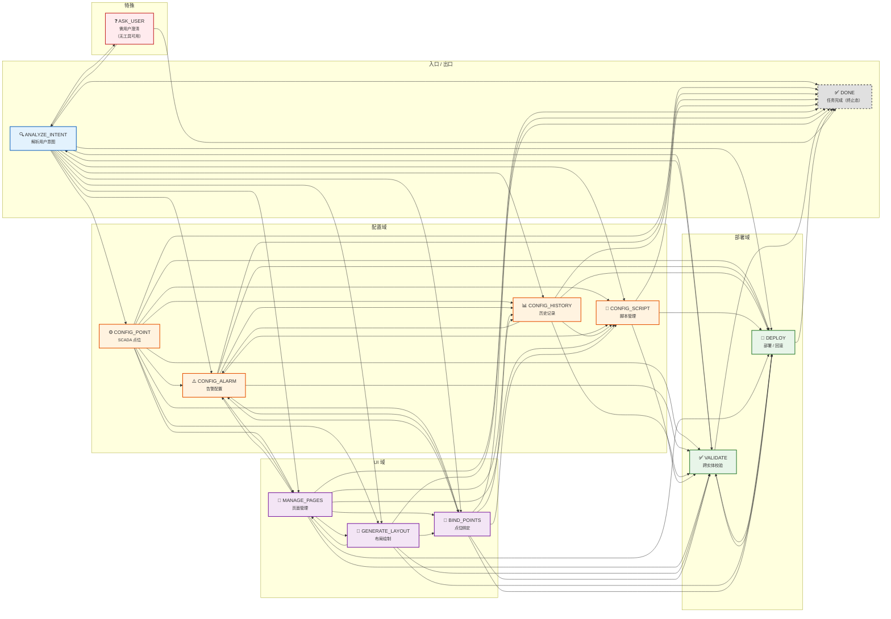
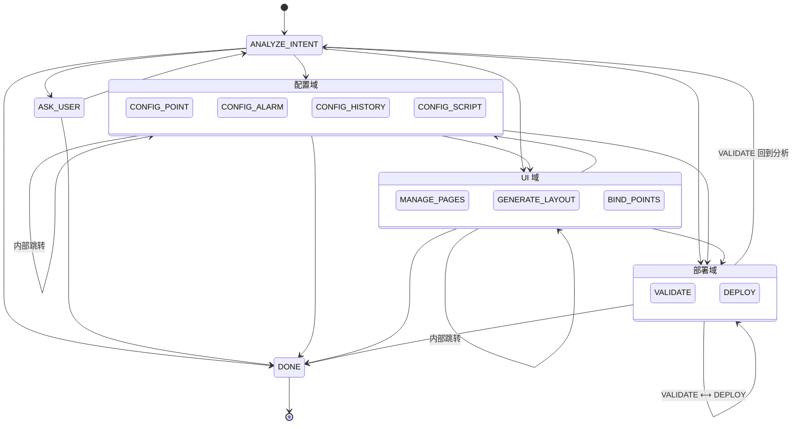

# State Machine Structure Diagram

Generated from `agent/state_machine.py` (276 lines)

## 以 State 为结点、Transition 为边的完整状态图



## 简化状态图（主路径）



## 状态定义

| 状态 | 描述 | 允许工具 | 可跳转至 | 终止态 |
|------|------|----------|----------|--------|
| **ANALYZE_INTENT** | 解析用户查询为高层意图 | 5 个 list/show 工具 | 11 个下游状态 | ❌ |
| **CONFIG_POINT** | 创建/更新/删除 SCADA 点位 | 4 个工具 | 9 个下游状态 | ❌ |
| **MANAGE_PAGES** | 创建/重命名/删除 HMI 页面 | 5 个工具 | 8 个下游状态 | ❌ |
| **GENERATE_LAYOUT** | 绘制图形、应用布局 | 9 个工具 | 5 个下游状态 | ❌ |
| **BIND_POINTS** | 将 SCADA 点位绑定到控件 | 3 个工具 | 6 个下游状态 | ❌ |
| **CONFIG_ALARM** | 创建/启用/禁用/删除告警 | 7 个工具 | 7 个下游状态 | ❌ |
| **CONFIG_HISTORY** | 配置历史采样/保留/查询 | 6 个工具 | 5 个下游状态 | ❌ |
| **CONFIG_SCRIPT** | 编写/启用/禁用脚本 | 7 个工具 | 3 个下游状态 | ❌ |
| **VALIDATE** | 部署前跨实体一致性检查 | 6 个工具 | 3 个下游状态 | ❌ |
| **DEPLOY** | 部署或回滚项目 | 4 个工具 | 2 个下游状态 | ❌ |
| **ASK_USER** | 需用户澄清（无工具可用） | 0 个工具 | 2 个下游状态 | ❌ |
| **DONE** | 任务完成 | 0 个工具 | 无 | ✅ |

## 全部状态转移表

| 当前状态 | 可跳转至 |
|----------|----------|
| **ANALYZE_INTENT** | CONFIG_ALARM, CONFIG_POINT, MANAGE_PAGES, GENERATE_LAYOUT, BIND_POINTS, CONFIG_HISTORY, CONFIG_SCRIPT, DEPLOY, VALIDATE, ASK_USER, **DONE** |
| **CONFIG_POINT** | MANAGE_PAGES, GENERATE_LAYOUT, CONFIG_ALARM, BIND_POINTS, CONFIG_HISTORY, CONFIG_SCRIPT, VALIDATE, DEPLOY, **DONE** |
| **MANAGE_PAGES** | GENERATE_LAYOUT, BIND_POINTS, CONFIG_ALARM, CONFIG_HISTORY, CONFIG_SCRIPT, VALIDATE, DEPLOY, **DONE** |
| **GENERATE_LAYOUT** | MANAGE_PAGES, BIND_POINTS, VALIDATE, DEPLOY, **DONE** |
| **BIND_POINTS** | CONFIG_ALARM, CONFIG_HISTORY, CONFIG_SCRIPT, VALIDATE, DEPLOY, **DONE** |
| **CONFIG_ALARM** | BIND_POINTS, MANAGE_PAGES, CONFIG_HISTORY, CONFIG_SCRIPT, VALIDATE, DEPLOY, **DONE** |
| **CONFIG_HISTORY** | CONFIG_SCRIPT, CONFIG_ALARM, VALIDATE, DEPLOY, **DONE** |
| **CONFIG_SCRIPT** | VALIDATE, DEPLOY, **DONE** |
| **VALIDATE** | DEPLOY, ANALYZE_INTENT, **DONE** |
| **DEPLOY** | VALIDATE, **DONE** |
| **ASK_USER** | ANALYZE_INTENT, **DONE** |
| **DONE** | （无 — 终止态） |

## 转移矩阵

列/行顺序与「全部状态转移表」一致（共 12 列 × 12 行）。

```
               To→
                 A  C  M  G  B  C  C  C  V  D  A  D
                 N  O  A  E  I  O  O  O  A  E  S  O
                 A  N  N  N  N  N  N  N  L  P  K  N
                 L  F  A  E  D  F  F  F  I  L  _  E
                 Y  I  G  R  _  I  I  I  D  O  U
                 Z  G  E  A  P  G  G  G  A  Y  S
                 E  _  _  T  O  _  _  _  T     E
From↓            _  P  P  E  I  A  H  S  E     R
                 I  O  A  _  N  L  I  C
                 N  I  G  L  T  A  S  R
                 T  N  E  A  S  R  T  I
                 E  T  S  Y     M  O  P
                 N        O        R  T
                 T        U        Y
                          T
ANALYZE_INTENT   ·  ✓  ✓  ✓  ✓  ✓  ✓  ✓  ✓  ✓  ✓  ✓
CONFIG_POINT     ·  ·  ✓  ✓  ✓  ✓  ✓  ✓  ✓  ✓  ·  ✓
MANAGE_PAGES     ·  ·  ·  ✓  ✓  ✓  ✓  ✓  ✓  ✓  ·  ✓
GENERATE_LAYOUT  ·  ·  ✓  ·  ✓  ·  ·  ·  ✓  ✓  ·  ✓
BIND_POINTS      ·  ·  ·  ·  ·  ✓  ✓  ✓  ✓  ✓  ·  ✓
CONFIG_ALARM     ·  ·  ✓  ·  ✓  ·  ✓  ✓  ✓  ✓  ·  ✓
CONFIG_HISTORY   ·  ·  ·  ·  ·  ✓  ·  ✓  ✓  ✓  ·  ✓
CONFIG_SCRIPT    ·  ·  ·  ·  ·  ·  ·  ·  ✓  ✓  ·  ✓
VALIDATE         ✓  ·  ·  ·  ·  ·  ·  ·  ·  ✓  ·  ✓
DEPLOY           ·  ·  ·  ·  ·  ·  ·  ·  ✓  ·  ·  ✓
ASK_USER         ✓  ·  ·  ·  ·  ·  ·  ·  ·  ·  ·  ✓
DONE             ·  ·  ·  ·  ·  ·  ·  ·  ·  ·  ·  ·
```

## 关键特征

1. **全连通性**：ANALYZE_INTENT 可达所有非终止态，DONE 是唯一终止态
2. **无环保障**：`transit()` 在运行时校验合法性，非法跳转会抛 `ValueError`
3. **回环路径**：VALIDATE → ANALYZE_INTENT 允许校验失败后重新分析
4. **ASK_USER 隔离态**：工具白名单为空，只能回到 ANALYZE_INTENT 或结束
5. **DEPLOY ↔ VALIDATE 互跳**：部署后可以重新校验，校验后可再部署
6. **典型主路径**：ANALYZE_INTENT → CONFIG_ALARM → DONE（最小 E2E 路径）

## 类结构

```
@dataclass(frozen=True)
StateSpec:
  name: str                          # 状态名
  description: str                   # 描述
  allowed_tools: frozenset[str]      # 该状态允许的工具白名单
  next_states: frozenset[str]        # 允许的下一状态集合
  terminal: bool = False             # 是否为终止态

STATES: dict[str, StateSpec]         # 全局状态目录（12 个条目）

INITIAL_STATE = "ANALYZE_INTENT"     # 初始状态

@dataclass
StateMachine:
  current: str = INITIAL_STATE       # 当前状态
  history: list[str] = field(        # 状态历史（自动追加）
      default_factory=list)

  __post_init__()                    # 校验初始状态并写入 history[0]
  can_transit(target) -> bool        # 检查是否可跳转
  transit(target)                    # 执行跳转（非法则抛 ValueError）
  is_terminal (property) -> bool     # 是否在终止态
  allowed_tools(state?) -> frozenset[str]  # 状态的工具白名单
  filter_tools(candidates) -> list   # 硬过滤：保留白名单内工具
```

## 执行示例：最小 E2E 路径

```
ANALYZE_INTENT
  ├── LLM 解析用户查询 → "创建告警"
  ├── filter_tools([list_points, create_page, ...]) → [list_points]
  └── transit("CONFIG_ALARM")
      │
CONFIG_ALARM
  ├── filter_tools([create_analog_alarm, create_digital_alarm, ...])
  ├── LLM 调用 create_analog_alarm
  ├── LLM 调用 set_threshold
  └── transit("DONE")
      │
DONE (terminal)
  └── is_terminal → True → 结束
```
