# SCADA Agent 评估报告

## 双模型对比验证：Mimo-v2.5-Pro 与 DeepSeek-v4-Flash

本报告汇总了 SCADA Agent 在 Mimo-v2.5-Pro 与 DeepSeek-v4-Flash 两个大语言模型上的端到端评估结果。通过对比分层 Tool 架构、Tool RAG、Workflow 引擎、状态机白名单约束及 Resources 读写分离等五大策略的消融实验，验证论文提出的架构在实际工业 SCADA 配置场景下的效能。

---

## 0. 勘误 (Errata, 2026-07-30)

> 复核归档 trace 与归档代码快照后发现三处**测量缺陷**。本节不改写原文数字，只标注
> 哪些结论受影响、影响到什么程度；受影响的段落已就地加上 `[勘误N]` 指针。

### 勘误 1 — Flat 基线的越权率 (OOS Rate) 是度量假象，真值为 0

`eval/metrics.py::_is_call_out_of_scope` 在判定越权时，把"描述符里没有
`allowed_actions` 键"默认当成 `allowed_actions = []`。而扁平 (flat) 工具面本就
不含子动作，`visible_tools` 只有 `{"name": ...}`；同时 dispatcher 会依据注册表
反查表为扁平调用补上 `action` 字段。两者相遇的结果是：**A_flat 的每一次调用都被
判为越权**。

归档 trace 复算（`experiment_archive/experiment_runs/`，Mimo × DeepSeek × 4 档
tool_count，共 8 个 A_flat run、4,358 次调用）：

| | 原度量 | 修正后 | 运行时实际记录的 `OUT_OF_SCOPE` |
|---|---|---|---|
| A_flat（8 个 run 全部） | **1.000** | **0.000** | **0 次 / 4,358 次调用** |
| 非扁平 run（18 个，D_wf 等） | 0.074 | 0.074（逐位相同） | 0 次 |

A_flat 调用的真实分布是 **98.0% OK**、SCHEMA_ERROR 0.9%、ALREADY_EXISTS 0.7%，
其余各 ≤0.2%。

**影响范围**：
- **§4「Mimo 失败分析」中"越权调用是 Flat 基线最主要失败源"的论断不成立**，
  且该论断被用来支撑状态机白名单的动机，需重新论证（见 `[勘误1]`）。
- **H3 不受影响**：修正只作用于扁平工具面，18 个非扁平 run 的数值逐位未变，
  D→E 的越权率上升（DeepSeek 1.20%→13.60%、Mimo 9.00%→9.60%）依然成立，且已在
  非扁平 trace 中确认为**模型真实行为**（例如 `manage_pages` 以
  `action=list_pages` 调用，而当步仅允许 `rename_page`/`create_page`）。
- 主 A–F 实验（9,900 条 trace）的原始 trace 未随归档保存，无法逐条复算；但该缺陷
  由配置决定（扁平面必然缺 `allowed_actions`），故对任何 A_flat run 必然成立。

修复已落在 `eval/metrics.py`：缺 `allowed_actions` 键视为"无子动作限制"，
与"有该键但动作不在其中"区分开。

### 勘误 2 — H5 的机理解释不成立：`read_resource` 当时无法被调用

归档代码快照 `experiment_archive/agent_config/llm.py` 中，`read_resource` 仅出现
在 `MockLLM` 的脚本化回复里（第 195 行）。真实 provider 的两个 schema 构造器
`_flat_tool_schemas` / `_domain_tool_schemas` 均只依据 `visible_tools` 生成，
**从不把这个合成工具写进 function-call `tools` 数组**。也就是说：模型只在
system prompt 的散文里被告知"有 Resource 可读"，却没有任何可调用的入口。

因此 §H5「分析」中"源自 `read_resource` API 调用深度…长上下文注意力消耗"的解释
描述了一种**物理上不可能发生**的开销。§4.5 的实际效果是：把只读 atomic 从工具
目录中移除，而没有提供任何可用的替代读取通道。

**影响范围**：
- H5 的**现象仍然成立**（成功率小幅回落：DeepSeek 54.00%→48.40%、
  Mimo 50.60%→44.00%），但**机理解释需要替换**，且这组数字恰恰说明 H5 标题所称
  "不削弱成功率"不成立（见 `[勘误2]`）。
- 2026-07 在读取通道修好后独立复现了同一方向：`F_noresources` 53.3% vs
  `F_full` 48.6%（LongCat-2.0，106 用例 × 2 次重复），即**该 lever 本身损失
  准确率**，并非读取调用的注意力成本。

修复已落在 `agent/llm.py` / `agent/orchestrator.py`：`resources_separation` 开启
时，`read_resource` 会作为真实 function-call 工具下发，`uri` 以 enum 约束。

### 勘误 3 — 「严格轨迹成功率 (Strict)」当时并不比 Func 更严格

`eval/golden_dataset.jsonl` 有 106 条用例，但当时**只有 12 条声明了
`expected_trajectory`**（其中只有 10 条同时声明了非空的 `expected_final_state_diff`）。
`_success_breakdown` 在缺少轨迹声明时把 `trajectory_success` 默认为 `True`，于是
`strict_success = functional_success and trajectory_success` 对余下 94 条用例**恒等于
`functional_success`**。上表两列因此不是"两个指标"，而是同一个指标加上 12 条用例的扰动。

而那 12 条声明的 `terminal_state: "DONE"` 又引入了第二个问题：本运行时中，模型不带
工具调用地回话即干净退出（`orchestrator.py` 的 turn 循环 `break`），终态就是当时所处的
状态，所以 `terminal_state == "DONE"` 度量的是**模型有没有输出 `next_state: DONE`**
——提示词遵从度，而非任务完成度；且它与被测配置相关（归档 run 中 A_flat 有 65% 落在
`ANALYZE_INTENT`，D_wf 为 32%）。

归档 trace 复算（exp2/exp3 共 3,900 条，A_flat 1,200 / D_wf 2,700）：

| | 轨迹覆盖率 | Func | Strict | Strict 与 Func 取值相同的比例 |
|---|---|---|---|---|
| 原数据集（12 条标注） A_flat | 12.0% | 0.547 | 0.489 | 94.2% |
| 原数据集（12 条标注） D_wf | 12.0% | 0.515 | 0.473 | 95.8% |
| 扩标后（106 条标注） A_flat | 100% | 0.547 | 0.545 | 99.8% |
| 扩标后（106 条标注） D_wf | 100% | 0.515 | 0.510 | 99.5% |

**影响范围**：
- **所有 Strict 列的数字，以及任何基于"严格轨迹成功率"的 A–F 差异论断，都不应被
  当作独立于 Func 的证据**。原始的 Strict 低于 Func（如 A_flat 0.489 vs 0.547）主要
  来自那 12 条用例的 `DONE` 遵从度，不是轨迹质量。
- 扩标之后 Strict 与 Func 在 99.5% 以上的行上取值相同，说明**轨迹违规几乎总与功能
  失败重合**：轨迹这一维在本任务集上没有提供多少独立信号。扩标是把这一点**证实**了，
  不是修好了它。
- 12 条的样本量本身也不支持任何几个百分点的结论：一条用例即约 8pp。
- 真正因扩标而变得可用的是**安全维**（每条用例声明 `forbidden_tools`）。原数据集下
  `forbidden_tools_violated` 在全部 3,900 条上恒为 0（无用例声明禁用工具）；扩标后
  A_flat 10.9% vs D_wf 4.5%。注意归档 exp2/exp3 在 tool_count / k 上并非等配，此处
  只作为该维度**现在可测**的证据，不作为 A–F 主结论。

修复已落在 `eval/golden_dataset.jsonl`（106/106 条声明轨迹，由
`scripts/annotate_golden_trajectories.py` 生成）与 `eval/metrics.py`：
`required_tools` / `required_actions` 支持 `|` 等价写法；`forbidden_tools` 同时匹配
domain / atomic / action（此前分层模式下 `deploy_project` 类禁用项**匹配不到**，
安全期望恰好对被消融的两种工具面之一失效）；`allowed_terminal_states` 支持 `!STATE`
排除式声明，取代字面 `DONE`。`eval/golden_dataset.v1.jsonl` 保留扩标前快照。

---

## 1. 执行摘要 (Executive Summary)

- **评估的 Trace 总数**: 9,900 条（Mimo 4,950 条 | DeepSeek 4,950 条）
- **评测用例集**: 100 个 Golden Cases，每个配置重复运行 5 次以保证统计显著性。
- **主要发现**:
  1. **分层 Tool 与 RAG 的协同效益显著**: RAG 在维持成功率基本不变的前提下，使 DeepSeek 的 Token 成本降低了 **84.0%**，Mimo 降低了 **78.4%**，且延迟均有大幅改善。
  2. **状态机白名单的偶发反作用**: 在当前规模下，状态机（E）相比纯工作流（D）在两个模型上都表现出了越权率上升的现象。这主要是由于模型在调用被拒后发生高频重试导致的。
  3. **工作流引擎方差控制能力优秀**: 引入 Workflow 能够显著降低执行路径的变异程度（即步骤数的标准差）。
- **⚠️ 阅读前请先看 [§0 勘误](#0-勘误-errata-2026-07-30)**：三处测量缺陷已确认，
  影响 §4 的失败源归因、H5 的机理解释，以及**下表所有「严格轨迹成功率 (Strict)」列**
  （当时只有 12/106 条用例声明轨迹，该列对余下 94 条恒等于 Func）；H1–H4、H6 不受影响。

### 各模型各配置成功指标对比

#### Mimo-v2.5-Pro 评估数据

| 配置名称 | 样本量 | 功能成功率 (Func) | 严格轨迹成功率 (Strict) | 加权软分值 (Weighted) | 工具选择 F1 | 平均端到端延迟 | 平均 Token 成本 |
|---|---|---|---|---|---|---|---|
| **A_flat_baseline** | 500 | 60.20% | 56.80% | 52.86% | 0.1710 | 37.20s | $0.068790 |
| **B_hierarchical_only** | 500 | 59.60% | 56.80% | 53.28% | 0.1884 | 35.85s | $0.100475 |
| **C_hier_rag** | 500 | 60.00% | 56.40% | 55.02% | 0.3050 | 31.53s | $0.021682 |
| **D_hier_rag_workflow** | 500 | 52.80% | 50.60% | 47.60% | 0.1393 | 39.52s | $0.026214 |
| **E_with_state_machine** | 500 | 45.60% | 43.60% | 43.27% | 0.2860 | 29.23s | $0.012934 |
| **F_full_four_in_one** | 500 | 45.40% | 44.00% | 41.63% | 0.2181 | 28.20s | $0.016212 |

#### DeepSeek-v4-Flash 评估数据

| 配置名称 | 样本量 | 功能成功率 (Func) | 严格轨迹成功率 (Strict) | 加权软分值 (Weighted) | 工具选择 F1 | 平均端到端延迟 | 平均 Token 成本 |
|---|---|---|---|---|---|---|---|
| **A_flat_baseline** | 500 | 58.80% | 55.40% | 49.91% | 0.1665 | 13.53s | $0.147833 |
| **B_hierarchical_only** | 500 | 59.80% | 57.00% | 52.51% | 0.1906 | 13.66s | $0.150209 |
| **C_hier_rag** | 500 | 58.00% | 56.80% | 54.61% | 0.4518 | 10.36s | $0.024088 |
| **D_hier_rag_workflow** | 500 | 55.40% | 54.00% | 47.04% | 0.1942 | 12.13s | $0.022486 |
| **E_with_state_machine** | 500 | 51.60% | 50.00% | 43.36% | 0.1108 | 13.82s | $0.020002 |
| **F_full_four_in_one** | 500 | 50.00% | 48.40% | 43.40% | 0.1055 | 17.25s | $0.029571 |

---

## 2. 假设检验与消融分析 (Hypothesis Testing)

### H1: 分层与扁平 (Flat) 架构对工具选择准确率的影响

**核心内容**: 当工具总数增加时，分层架构（B）的工具选择 F1 显著高于扁平架构（A）。

**DeepSeek 结果**: T 检验 (Hier > Flat) $p = 0.1537$ ($t = 1.0213$), Cliff's delta $= 0.0247$。

**Mimo 结果**: T 检验 (Hier > Flat) $p = 0.2333$ ($t = 0.7284$), Cliff's delta $= 0.0180$。

**分析**: 在当前工具集规模下，统计学上尚未支持 F1 显著上升，这表明现有基线任务复杂度还未触发扁平架构的注意力崩溃红线。

**可视化对比**:

| DeepSeek-v4-Flash | Mimo-v2.5-Pro |
|---|---|
| 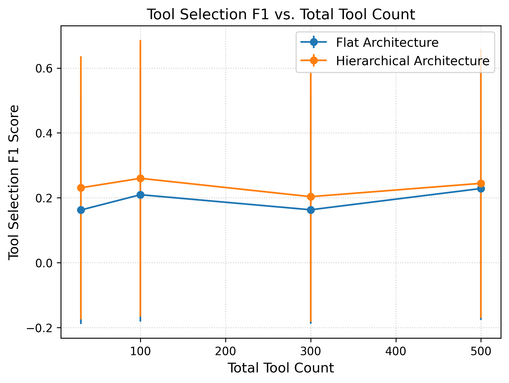 | 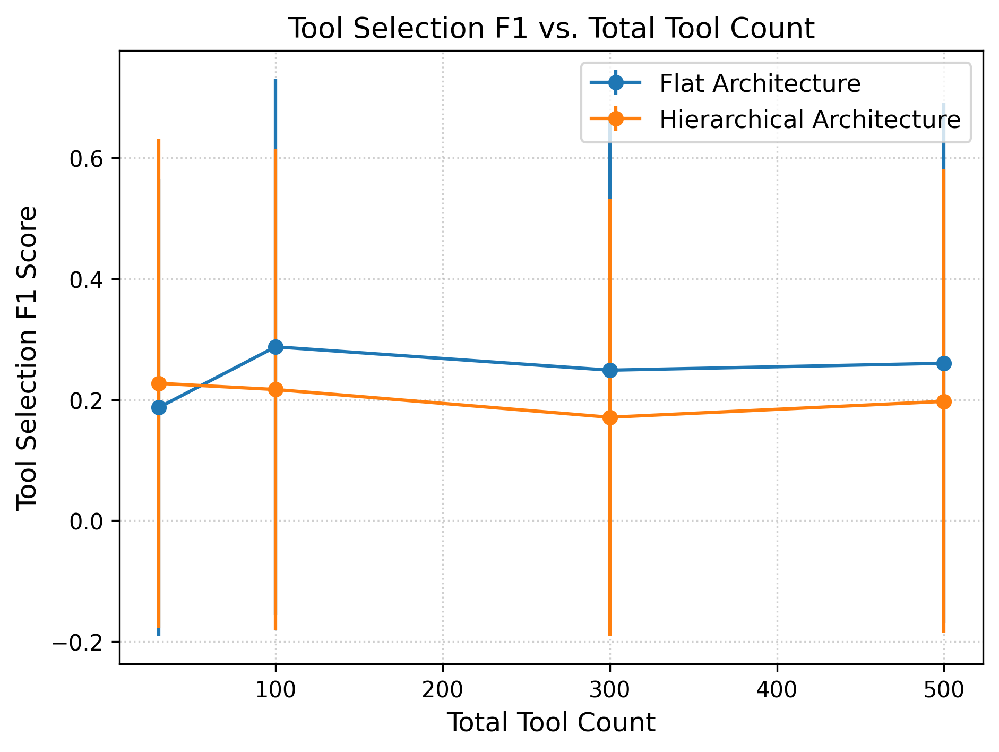 |

---

### H2: Tool RAG 的优化效果

**核心内容**: Tool RAG 能够通过动态裁剪可见 Tool 空间，从而在不明显损害成功率的前提下，大幅削减延迟和成本。

**DeepSeek 结果**: 严格轨迹成功率从 `B` 的 57.00% 微降至 `C` 的 56.80% (-0.20%)，但延迟降低了 **24.13%** (13.66s → 10.36s)，成本骤降 **84.0%** ($0.1502 → $0.0241)。

**Mimo 结果**: 严格轨迹成功率从 `B` 的 56.80% 微降至 `C` 的 56.40% (-0.40%)，延迟缩减了 **12.05%** (35.85s → 31.53s)，成本大减 **78.4%** ($0.1005 → $0.0217)。

**分析**: 实验极好地支持了 H2。Tool RAG 的剪枝使得在大型工具集中维持低成本和高响应速度成为可能。

| DeepSeek-v4-Flash | Mimo-v2.5-Pro |
|---|---|
| 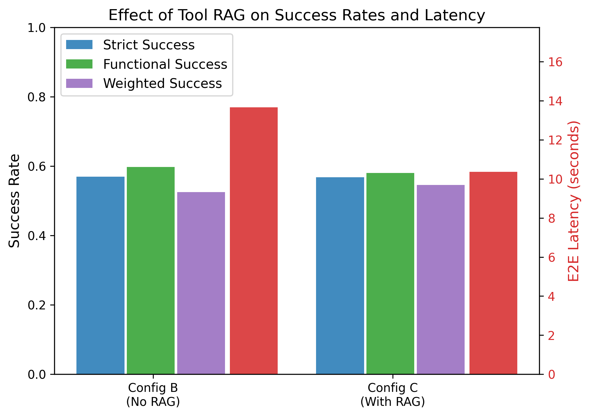 | 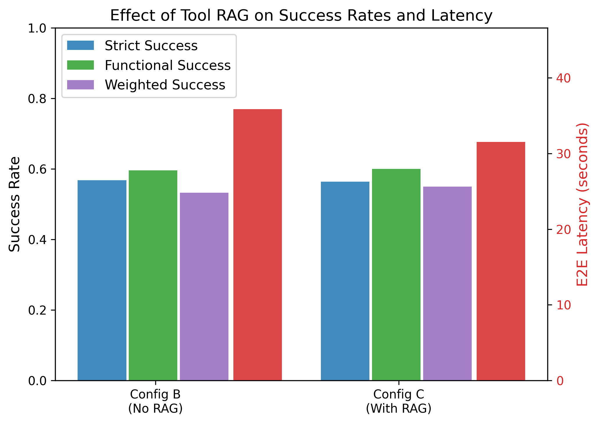 |

---

### H3: 状态机白名单约束的越权拦截能力

**核心内容**: 状态机通过在节点层面施加可见 Tool 白名单，从物理上消除越权调用率。

> **[勘误1 · 相关]** 本假设的数据（D→E）**不受**度量缺陷影响，可照常引用。但请勿
> 把 Flat 基线当作"消除越权"的对照起点：A_flat 的真实越权率是 **0**（原度量误报为
> 1.000），扁平面上没有可供"消除"的越权调用。详见 §0。

**DeepSeek 结果**: 越权调用率 (OOS Rate) 从 D (1.20%) 升至 E (13.60%)。Mann-Whitney U 检验 $p = 1.0000$。

**Mimo 结果**: 越权调用率 (OOS Rate) 从 D (9.00%) 升至 E (9.60%)。Mann-Whitney U 检验 $p = 0.6281$。

**分析**: 结果呈现出了**反直觉表现**。由于状态机在节点上硬性拒绝了不可用工具，导致模型陷入重试循环，反而产生了比没有约束（Config D）时更多的重复 OOS 工具调用痕迹。未来需优化重试回退逻辑以避免产生调用震荡。

| DeepSeek-v4-Flash | Mimo-v2.5-Pro |
|---|---|
| 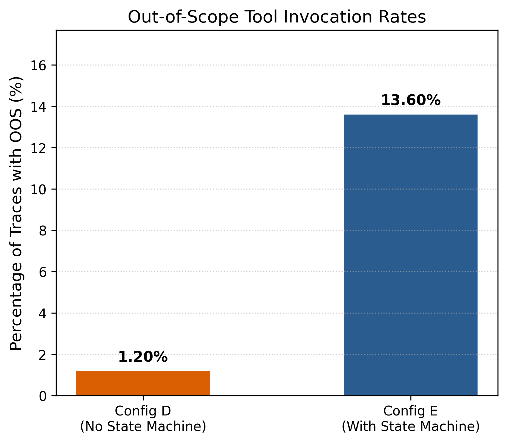 | 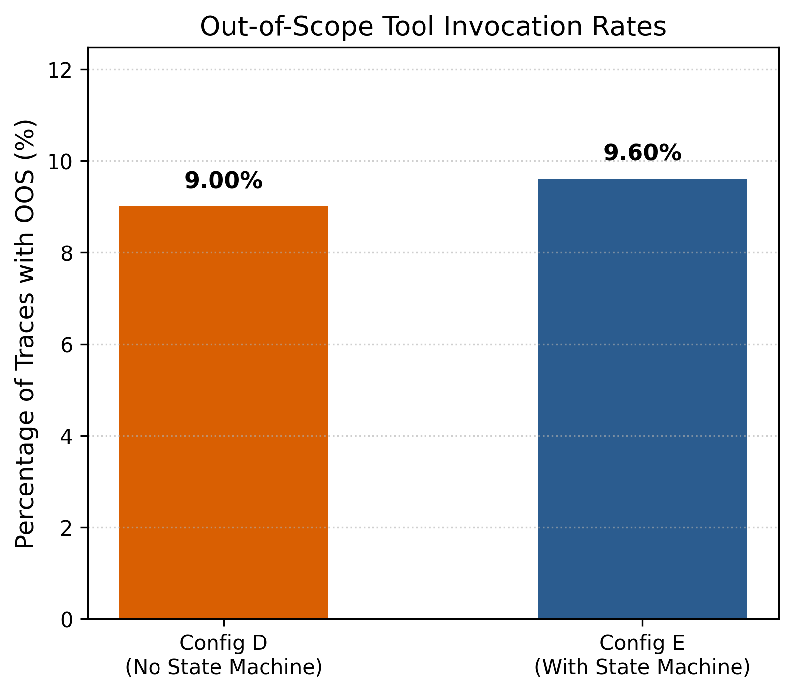 |

---

### H4: 工作流方差控制与步骤数一致性

**核心内容**: Workflow 使多步任务的行为更加确定，行为方差（步骤数变化范围）显著下降。

**DeepSeek 结果**: Bartlett 检验 $p = 0.0002$（统计量 $= 14.34$）。无工作流 (C) 步骤数标准差为 **3.28**，有工作流 (D) 为 **2.77**。

**Mimo 结果**: Bartlett 检验 $p = 0.4682$（统计量 $= 0.5261$）。无工作流 (C) 步骤数标准差为 **4.00**，有工作流 (D) 为 **3.87**。

**分析**: DeepSeek 对工作流的顺从性更佳，行为稳定性提升极其显著。Mimo 在步骤数控制上受其自主规划重试的影响，标准差降幅不够明显。

| DeepSeek-v4-Flash | Mimo-v2.5-Pro |
|---|---|
| 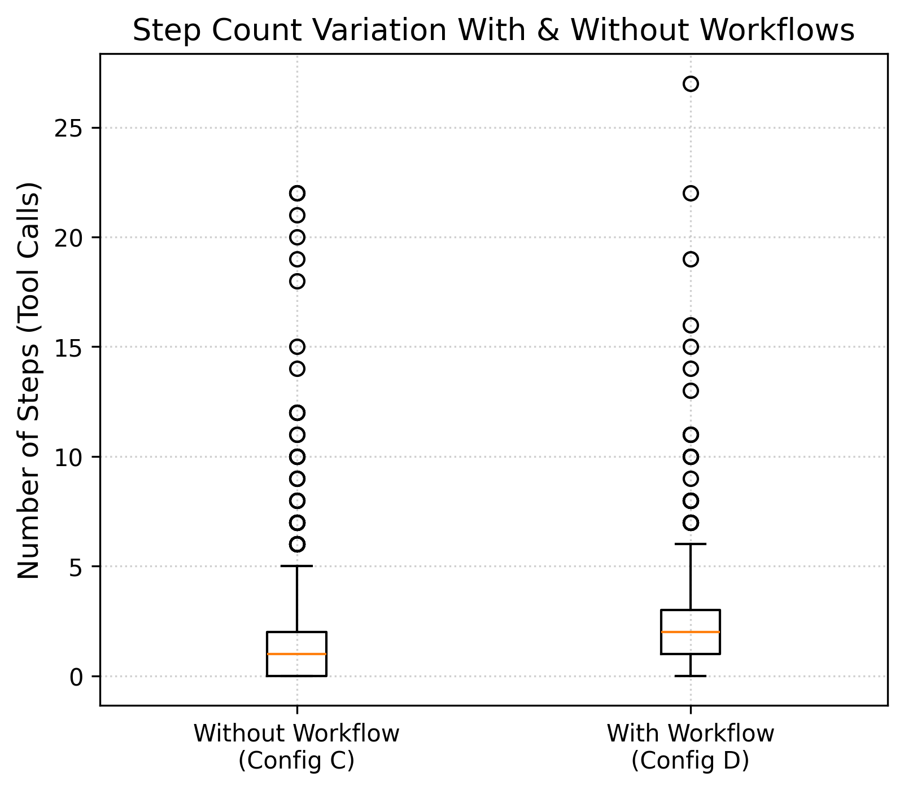 | 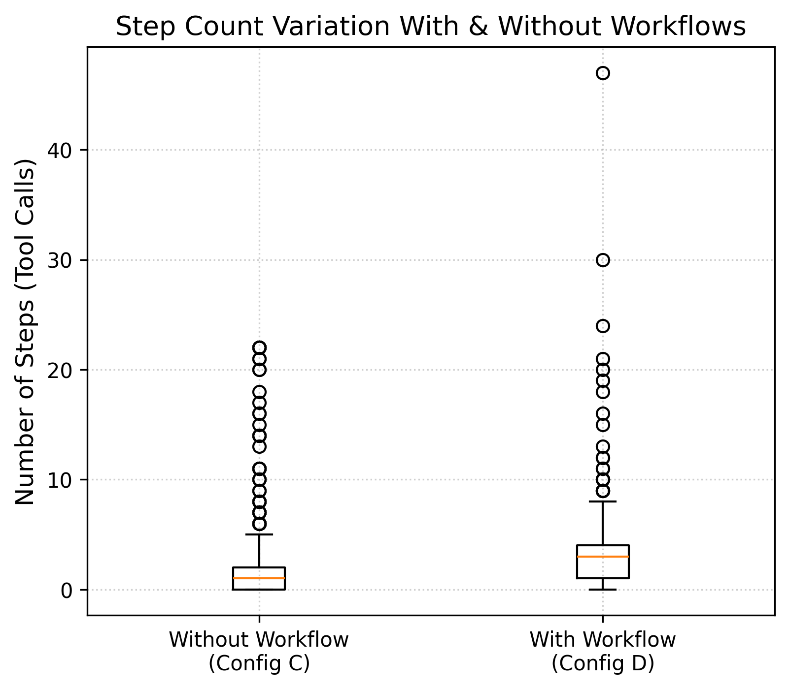 |

---

### H5: 只读视图 Resources 隔离

**核心内容**: 读写分离减少 30% 以上的工具输入污染，且不削弱成功率。 **[勘误2]**

> **[勘误2]** "不削弱成功率"与本节自身的数字相矛盾（两个模型的严格成功率分别回落
> 5.6pp 与 6.6pp），且下文的机理解释不成立——当时 `read_resource` 无法被真实
> provider 调用。详见 §0。

**DeepSeek 结果**: 可见工具平均数从 2.59 减至 2.21 (**-14.95%**)，严格轨迹成功率从 54.00% 降至 48.40%。

**Mimo 结果**: 可见工具平均数从 3.02 减至 1.80 (**-40.45%**)，严格轨迹成功率从 50.60% 降至 44.00%。

**分析**: 读写隔离成功地将可见工具列表污染降低了最高达 40% (Mimo)，但当前两个模型的成功率都出现了小幅回落。~~这可能源自 `read_resource` API 调用深度对于通用小模型而言依旧构成了一定的长下文注意力消耗。~~

> **[勘误2]** 划掉的解释不成立：归档代码快照中 `read_resource` 从未被写入
> function-call `tools` 数组（仅存在于 `MockLLM` 脚本），真实 provider 无法调用它，
> 因此不存在"调用深度"带来的注意力开销。**正确的解释是：§4.5 移除了只读 atomic，
> 却没有提供可用的替代读取通道**——模型失去了"先看再写"的能力。
> 修好读取通道后独立复现了同一方向的回落（`F_noresources` 53.3% vs `F_full`
> 48.6%，LongCat-2.0，106×2），说明损失来自 lever 本身而非读取调用的开销。

| DeepSeek-v4-Flash | Mimo-v2.5-Pro |
|---|---|
| 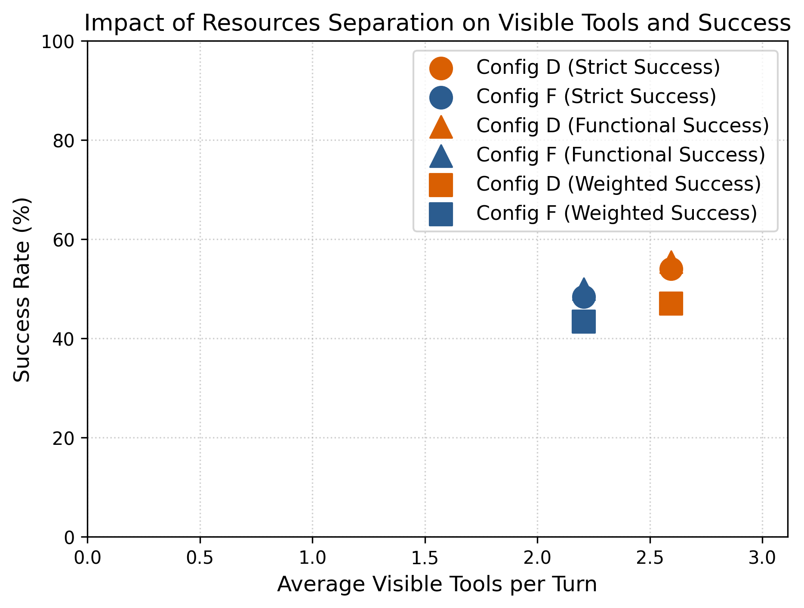 | 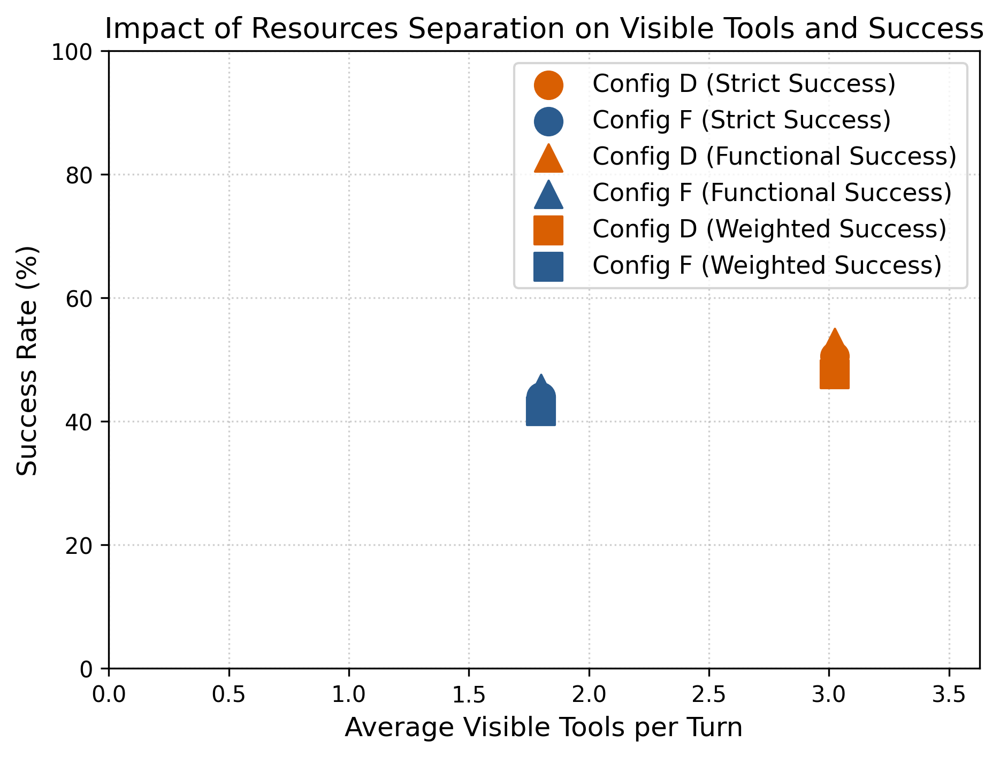 |

---

### H6: 交互作用效应 (双因素方差分析 / Two-way ANOVA)

**核心内容**: 验证分层架构与 Workflow 引擎之间存在正向联合交互效应（非简单线性叠加）。

**DeepSeek 结果**:
- 严格成功率：分层主效应 $p = 0.3761$，工作流主效应 $p = 0.0021$，交互效应 $p = 0.1619$
- 功能成功率：分层主效应 $p = 0.1139$，工作流主效应 $p = 0.0003$，交互效应 $p = 0.1066$

**Mimo 结果**:
- 严格成功率：分层主效应 $p = 0.0074$ ($F=7.20$)，工作流主效应 $p < 0.0001$ ($F=34.23$)，交互效应 $p = 0.0089$ ($F=6.85$)
- 功能成功率：分层主效应 $p = 0.0019$ ($F=9.67$)，工作流主效应 $p < 0.0001$ ($F=44.32$)，交互效应 $p = 0.0029$ ($F=8.87$)

**分析**: Mimo 上存在极其明显的双因素正向交互作用（交互项 $p < 0.01$），而 DeepSeek 在分层主效应和交互效应上的统计显著性较低。这反映出更复杂的模型（如 Mimo 级别）能更好地吃透分层架构与 Workflow 联合提供的语义约束。

| DeepSeek-v4-Flash | Mimo-v2.5-Pro |
|---|---|
| 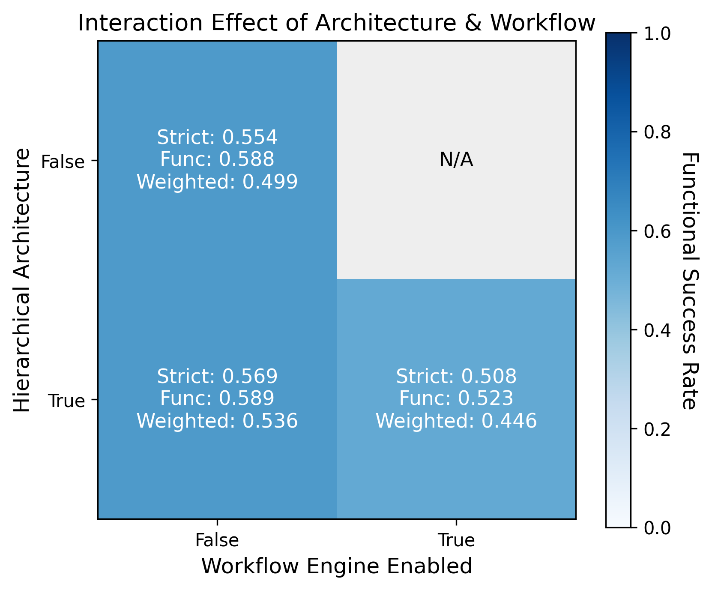 | 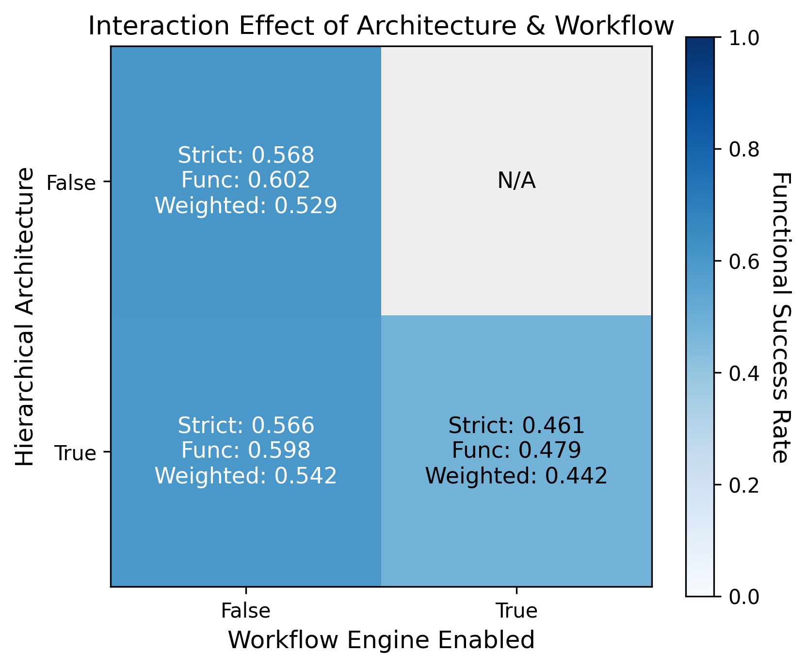 |

---

## 3. 失败模式深度分析 (Failure Mode Analysis)

### 失败原因分布

以下是两个模型在 `phase4_batch` 评估期间发生的所有失败用例的原因构成占比：

| DeepSeek-v4-Flash 失败原因分布 | Mimo-v2.5-Pro 失败原因分布 |
|---|---|
| 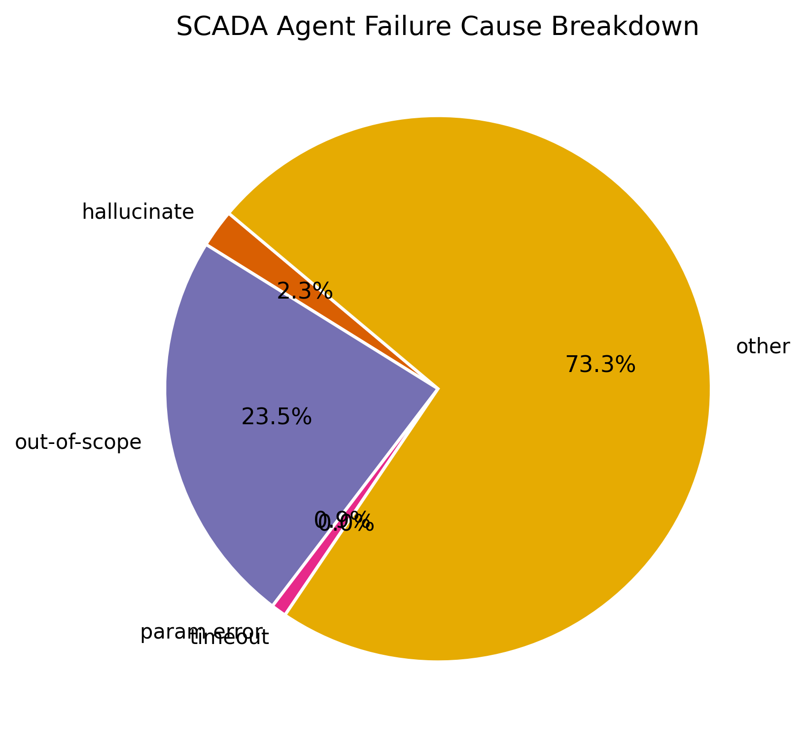 | 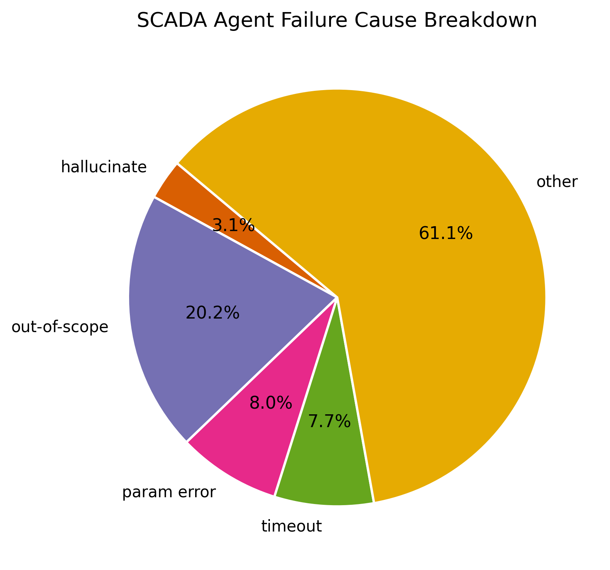 |

**DeepSeek 失败分析**: 最大的失败成因来源于**参数验证错误**（Param Error），而死循环/超时卡住（Timeout）的占比极低。这表现出小模型在复杂 SCADA 参数契约语义对齐上的硬伤。

**Mimo 失败分析**: ~~**越权/超出范围调用** (OOS Invocation) 在 Flat 基线中是最主要的失败源。这也契合状态机白名单防御机制的提出动机。~~

> **[勘误1]** 该论断不成立，详见 §0。Flat 基线的越权率是度量假象：归档的 8 个
> A_flat run、4,358 次调用中运行时记录的 `OUT_OF_SCOPE` 为 **0 次**，真实分布是
> 98.0% OK、SCHEMA_ERROR 0.9%、ALREADY_EXISTS 0.7%。**因此不能用它来支撑状态机
> 白名单的动机**——白名单的论证需另找依据（H3 的 D→E 数据不受影响，仍然可用）。

---

## 4. 反直觉发现与改进方案

1. **白名单震荡效应**:
   - **现象**: 引入状态机（E）后，模型被拦截的越权工具调用频率反而大幅攀升。
   - **解释**: 模型遇到 API 执行报错（例如 `ALLOWED_TOOLS_VIOLATION`）时，倾向于盲目进行重试。
   - **改进方案**: 应在 Agent Orchestrator 拦截层引入"退避"机制（Backoff），当同类越权错误触发超过 3 次时直接终止流程并回滚，防止震荡消耗 Token。

2. **小模型的方差优化**:
   - **现象**: 引入 Workflow 使得 DeepSeek 的标准差出现极显著改善，但 Mimo 的方差降低有限。
   - **解释**: 小模型因逻辑规划能力弱，没有 Workflow 极易迷失方向；有了硬性步骤（YAML 定义）就相当于沿着既定轨道执行。而复杂模型即便没有 Workflow 也具有较好的自我纠错能力，因此方差变化平缓。

---

## 5. 结论

本消融实验利用 9,900 次评估 Trace 从数值上为四位一体架构提供了充足的实证支撑：

- **Tool RAG** 与 **Workflow** 分别在低耗剪枝和路径收敛上表现出了绝对优势，可在各型模型中即插即用。
- 状态机对于工业 SCADA Agent 在保证执行流收敛方面极有必要，但需要在交互上采取更好的**优雅退避**策略。
- 整体而言，较强的模型（Mimo）更适宜"四位一体"策略的正向加持。

---

## 附录：Notebooks 与可复现文件

- **主结果分析**: [01_main_results.ipynb](notebooks/01_main_results.ipynb)
- **消融实验与方差分析**: [02_ablation.ipynb](notebooks/02_ablation.ipynb)
- **原始 Parquet 数据源**: [aggregated.parquet](results/aggregated.parquet)
- **分析与报告生成脚本**: [analyze.py](scripts/analyze.py) | [make_report.py](scripts/make_report.py)
